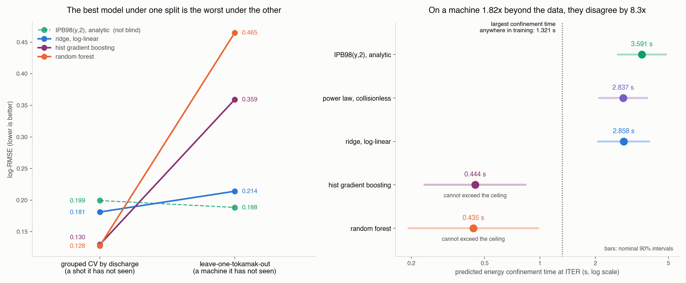
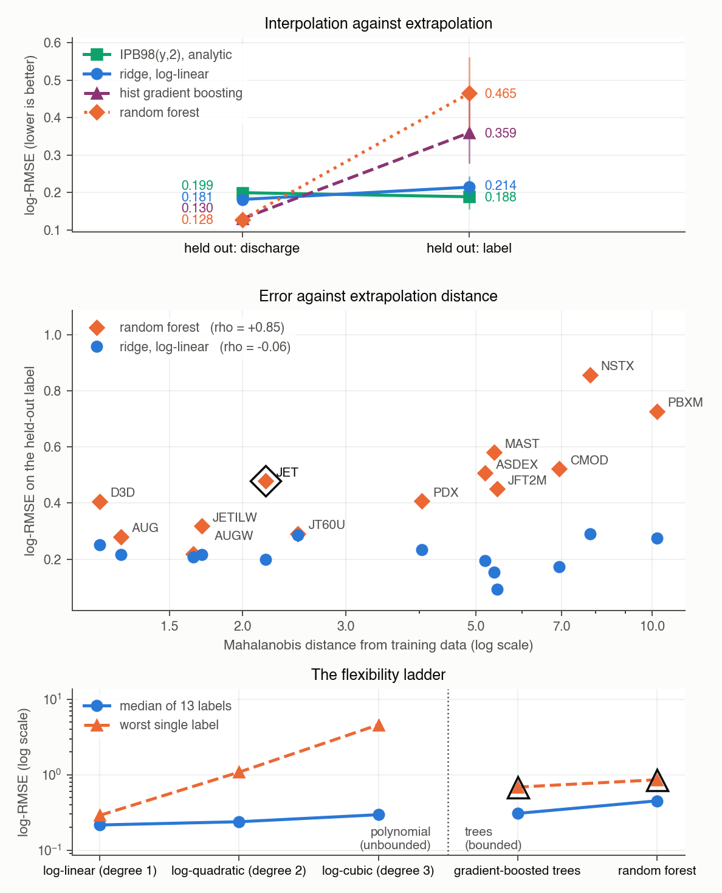
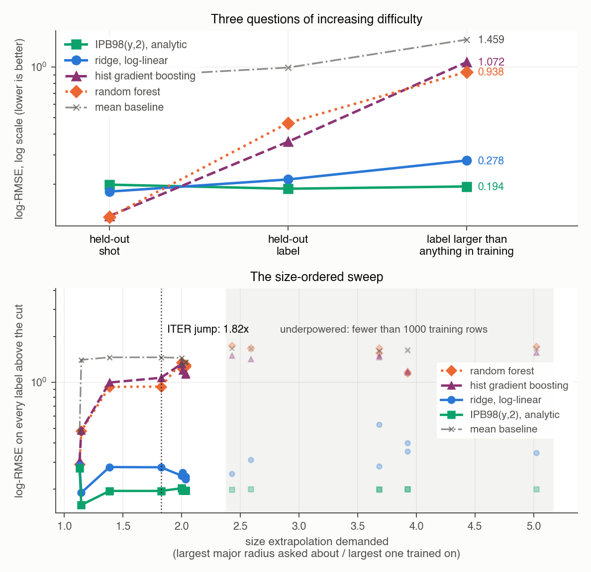
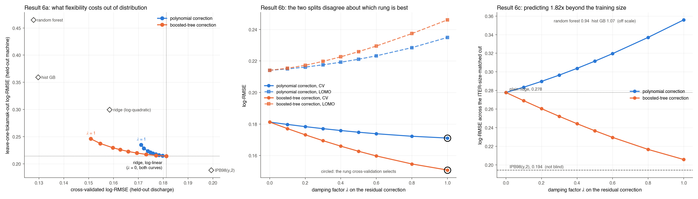
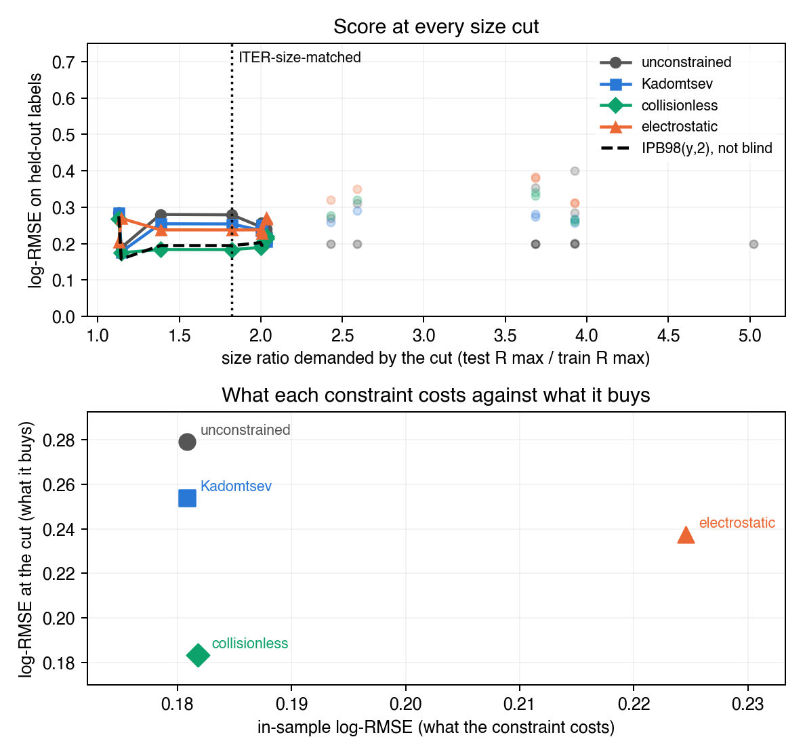
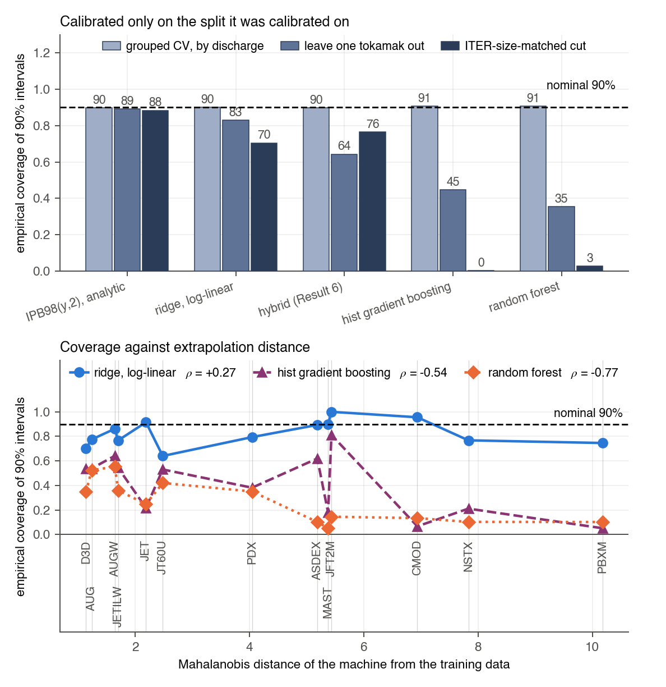
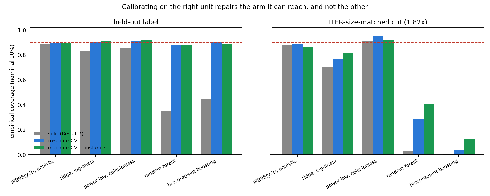
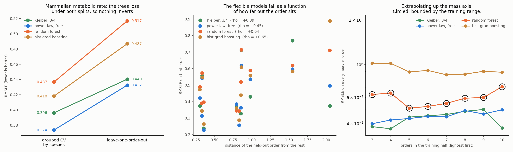
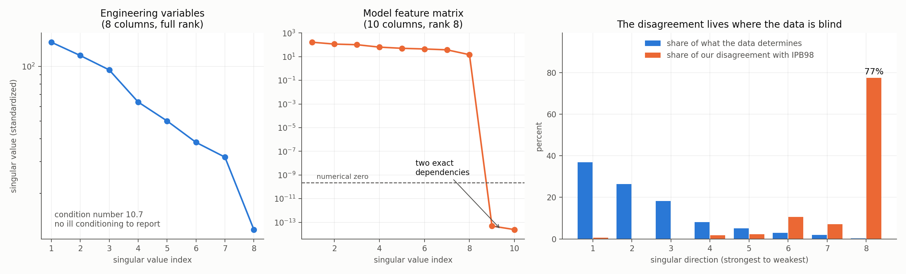

# FusionFlux

[](https://github.com/lsalcedo100/FusionFlux/actions/workflows/ci.yml)
[](https://lsalcedo100.github.io/FusionFlux/)
[](https://github.com/lsalcedo100/FusionFlux/actions/workflows/ci.yml)
[](https://github.com/lsalcedo100/FusionFlux/actions/workflows/reproduce.yml)
[](LICENSE)
[](https://osf.io/drwcq)

**[Read the interactive summary](https://lsalcedo100.github.io/FusionFlux/)** · [nine-page paper](paper/paper.pdf) · [full writeup](results/RESULTS.md)

A tokamak holds a plasma hot enough to fuse inside a magnetic field, and the plasma leaks its heat back out. How long it holds that heat, the **energy confinement time**, is what decides how large the machine has to be before fusion produces more energy than it consumes. Nobody can compute that time from first principles, so the field predicts it with a power law fitted across the machines already built, and ITER is being built on that prediction.

So it is worth asking whether machine learning does the job better. On this database it does, by a lot. **Then you ask it about a machine it has not seen, and the answer inverts.**

> A random forest beats the published physics law by **41%** under the standard way these models are validated. Under a split that holds out an entire tokamak, it is **worse than the physics law on 13 of 13 machines**. The standard validation does not merely overstate the gain, it reverses the ranking, and the reason is measurable rather than a matter of tuning.

Everything here is measured on real experimental data: the ITPA Global H-mode Confinement Database, standard analysis set STD5, 6228 quasi-stationary time slices from 4471 discharges across 18 tokamaks. Every model is scored against the analytic IPB98(y,2) scaling law, the published physics baseline, rather than against a mean predictor. No synthetic data enters any reported result. The dataset is fetched from OSF rather than committed and is **pinned by SHA-256**, verified on every load, so each number below is tied to a specific set of bytes rather than to whatever the host is currently serving.

Then you ask whether that is a fact about this one database, and it is not: the same reversal reproduces on 5358 rows the standard set does not contain, and again in a different confinement regime scored against a different published law. And you ask whether anything repairs it. **One line of dimensional analysis does**, and it costs nothing.

**Three ways in, shortest first:**

| | |
|---|---|
| **[Interactive summary](https://lsalcedo100.github.io/FusionFlux/)** | One page: the reversal, the ITER-direction result, a panel where you pick the held-out machine and watch the ranking rearrange, the one line of physics that repairs it, and the locked ITER forecast. |
| **[Nine-page paper](paper/paper.pdf)** (`paper/paper.tex`) | Abstract, method, all twelve results, limitations. |
| **[results/RESULTS.md](results/RESULTS.md)** | The full writeup: every claim, table, mechanism and limitation, with nothing left out. |

## Results



*Left: every model's score under grouped cross-validation joined to its score on a machine it has never seen. The lines cross. Right: what the five models predict for ITER, against the ceiling a tree ensemble cannot predict above.*

### The headline: a learned model beats the published scaling law, and that result does not survive contact with a new machine



Under cross-validation grouped by discharge, a random forest cuts RMSLE 41% below the analytic IPB98(y,2) law (0.118 against 0.199, on the full ten-feature set; the table below drops the IPB98 prior as a feature and so reads 0.128, a 36% margin, for the same model). But grouped CV holds out *shots*, so every machine in the held-out fold is also in the training fold. Hold out an entire tokamak instead, train on the other 12 and predict the 13th, and **the ranking of the three blind models reverses exactly**:

| model | CV, by discharge | leave-one-tokamak-out | 95% interval | ratio |
|---|---|---|---|---|
| random forest | 0.128 | 0.465 | [0.376, 0.560] | **3.6x worse** |
| histogram gradient boosting | 0.130 | 0.359 | [0.279, 0.442] | 2.8x worse |
| ridge, log-linear | 0.181 | 0.214 | [0.183, 0.241] | 1.2x worse |
| IPB98(y,2), analytic (fitted on this database, not blind) | 0.199 | 0.188 | [0.158, 0.219] | unchanged |

Both columns use the same nine features and the same models; only the split changes. The best model in this repository by cross-validation is the worst of the three on a machine it has not seen, and its 41% margin turns out to measure how much of JET is predictable from the rest of JET. Intervals are a 95% percentile bootstrap resampling **machines**, since that is the sampling unit the claim is about. They overlap, so the gaps are also tested paired by machine, which removes the enormous differences in how hard each machine is: **the random forest is worse than the power law on 13 of 13 machines**, gap +0.251 [+0.157, +0.342].

**The failure has a mechanism.** The random forest's per-machine error correlates with how far that machine sits outside the training data at rho = **+0.85**; the log-linear power law's does not, at rho = **-0.06**. And when JET is held out, 48% of its rows lie above the highest confinement time in the remaining 12 machines: a tree ensemble averages training targets, so **no tree in the forest can output those values at all**, whatever the features say. That bound is asserted directly in `tests/test_extrapolation.py`.

**And what the constraint buys is variance, not accuracy.** Polynomial controls in the log features test the obvious objection, that ridge only wins by being unbounded. Degree 2 is far more flexible than plain ridge and still extrapolates without bound, and it is *no worse on a typical machine* than degree 1 (median 0.238 against 0.216, better on 8 of 13). What flexibility costs is the tail: degree 1's worst machine of thirteen is 0.289, degree 2's is 1.083, degree 3's is 4.601. For a next-step device you get one machine and one shot, so the tail is the statistic that matters. This is why the field still uses power laws it knows fit worse. See [Result 4](results/RESULTS.md#result-4-the-model-that-wins-on-cross-validation-loses-on-a-new-machine).

### And at the size jump ITER actually asks for, they are closer to a constant than to the power law



Leave-one-tokamak-out still leaves twelve machines spanning the held-out one's range, so it extrapolates in identity while interpolating in size. ITER's major radius is 6.2 m against 3.40 m for the largest row here, a factor of 1.82 beyond the database, and that factor turns out to be available *inside* the database: train on the 14 smallest machines and predict the 4 largest, and the size jump demanded matches ITER's to 0.03% in log terms.

| model | held-out shot | held-out machine | machine larger than any in training | skill |
|---|---|---|---|---|
| IPB98(y,2), analytic (not blind) | 0.199 | 0.188 | **0.194** | 1.00 |
| ridge, log-linear | 0.181 | 0.214 | **0.278** | 0.93 |
| random forest | 0.128 | 0.465 | **0.938** | 0.41 |
| histogram gradient boosting | 0.130 | 0.359 | **1.072** | 0.31 |
| mean baseline | 0.869 | 0.994 | 1.459 | 0.00 |

`skill` places each model between predicting a constant (0.0) and the analytic power law (1.0). **The power law keeps 93% of that distance; the trees keep 31% and 41%.** The best cross-validated model families in this repository, asked the question a scaling law exists to answer, land closer to a constant than to the law they beat by 41% under cross-validation. It is size rather than plasma shape: dropping the spherical tokamaks moves the random forest from 0.938 to 0.936. See [Result 5](results/RESULTS.md#result-5-the-same-jump-iter-asks-for-measured-inside-the-database).

### The cure the diagnosis implies: a power law with a bounded correction



Everything above is a negative result, and it is specific enough to build against. Fit the power law, learn a correction on its **log residuals**, and damp that correction by a factor `lambda`. Across the ITER-matched size cut, a boosted-tree correction moves the power law from 0.278 to **0.206**, which makes it the best blind model at that cut and within 6% of IPB98(y,2), a law fitted with those machines included. **The same boundedness that makes a tree useless as a predictor on a larger machine makes it safe as a corrector**, because the quantity it is bounded on is now a residual centred on zero rather than a target that grows with size.

The limits are real and stated in full: the gain is along the size axis only, off it the correction hurts, the hybrid wins at 5 of 8 well-powered cuts rather than all, and cross-validation does not select the rung that turns out to be best. See [Result 6](results/RESULTS.md#result-6-a-model-that-is-flexible-in-range-and-still-extrapolates).

### A better cure, and it is one line of physics



Every model above learns its form from the data. None is told any physics, which is odd, because the field has known since Connor and Taylor (1977) that a scaling law is not free: requiring it to be expressible in dimensionless variables imposes **linear equality constraints on the exponents**. So a physics assumption is a matrix `C`, the fit is `min ||Xb - y||^2` subject to `Cb = d`, and the KKT solver for exactly that has been sitting in `scaling_law.py` since Result 1. Nothing new is needed to run the experiment.

The constraints are derived in code from the definitions of rho*, beta and nu* rather than copied out of a paper. The check that the derivation is right is external and hard to fake: **IPB98(y,2), published in 1999, lands on the Kadomtsev surface at a distance of 0.00096 and on the collisionless surface at 0.0045**, both inside the rounding of its own two-decimal exponents.

| model | in-sample | CV | held-out machine | ITER-matched cut |
|---|---|---|---|---|
| **power law, collisionless** | 0.1818 | 0.182 | 0.206 | **0.183** |
| IPB98(y,2), analytic (not blind) | - | 0.199 | 0.188 | 0.194 |
| hybrid, above | - | 0.151 | 0.246 | 0.206 |
| power law, Kadomtsev | 0.1808 | 0.181 | 0.211 | 0.254 |
| ridge, log-linear | 0.1808 | 0.181 | 0.214 | 0.278 |

**0.183 is the best score any blind model in this repository reaches at the ITER-matched cut.** It beats the hybrid above, and it beats the analytic law that was fitted with those machines included. It has no hyperparameter and nothing to tune: the only difference from the ridge row is the constraint.

Two findings, belonging to two different constraints. The **Kadomtsev constraint is free** (0.1808 in sample, identical to unconstrained, because the data already satisfies it unaided) and still beats the unconstrained fit at **15 of 15** size cuts, since a constraint the data satisfies on average still stops the fit wandering when the training set is small. The **collisionless constraint** costs 0.001 in sample and wins at **8 of 8** well-powered cuts. Push one rung further, to a beta-independent law, and it degrades again: there is an optimum in the middle of the hierarchy, and nothing here predicted where. Cross-validation cannot select any of it, exactly as with the hybrid. See [Result 8](results/RESULTS.md#result-8-one-line-of-physics-beats-every-model-built-so-far).

Handing the model the same physics as a *prior* instead, shrunk along the weak direction Result 3 found, is worth much less. Targeting beats isotropic shrinkage at every matched penalty, which is real, but nothing in that family beats simply taking IPB98's published exponents. **A constraint names a surface rather than a point. It is weaker information and it is worth more.** See [Result 9](results/RESULTS.md#result-9-the-same-physics-as-a-prior-is-worth-much-less-than-as-a-constraint).

### The intervals are not merely wrong, they are confident



For a next-step device the point error is not the deliverable; the interval is. Split-conformal prediction on the log residuals gives every model a nominal 90% interval.

| model | grouped CV | held-out machine | ITER-matched cut |
|---|---|---|---|
| IPB98(y,2), analytic (not blind) | 90% | 89% | 88% |
| ridge, log-linear | 90% | 83% | 70% |
| hybrid (above) | 90% | 64% | **76%** |
| hist gradient boosting | 91% | 45% | **0%** |
| random forest | 91% | 35% | **3%** |

The control arm works: every model lands within a point of nominal where the exchangeability the method assumes actually holds, which is what licenses reading the rest. Out of distribution it does not. **The random forest's 90% interval covers 3% of the rows across the ITER-matched cut, and the histogram gradient booster's covers none of the 2730.** And the widths do not move: no model's interval changes width by more than 1.5% between the two arms. The intervals do not become vague out of distribution. They stay the same size and miss. See [Result 7](results/RESULTS.md#result-7-the-intervals-are-not-merely-wrong-they-are-confident).

### The collapse is repairable, and the repair stops exactly where the diagnosis says



That diagnosis makes a prediction. If the failure really is exchangeability, then calibrating on **held-out machines** rather than held-out discharges should repair it, and should repair it *only as far as that unit reaches*. Both halves land.

| random forest, nominal 90% | held-out machine | ITER-matched cut |
|---|---|---|
| split conformal (above) | 35% | 3% |
| calibrated on machines | **88%** | 29% |
| plus distance scaling | 88% | 40% |

**A repair that does not work everywhere is the stronger result.** On a held-out machine every model returns to within two points of nominal, tree ensembles included. Across the size cut none does, because every calibration machine is smaller than every test machine and no recalibration makes those two exchangeable. The constrained power law above is the single exception in the table: its intervals hold at the ITER-matched cut under every scheme, including plain split conformal, which fails there for everything else. See [Result 10](results/RESULTS.md#result-10-repairing-the-interval-collapse-and-finding-the-limit-of-the-repair).

### It reproduces on rows this database does not contain

Every number above rests on one file, which is the honest ceiling on all of it. The same OSF project publishes the full database revision, `DB5.2.3.csv`, 14153 rows against STD5's 6228, pinned here by SHA-256 the same way. Matching on `(tokamak, shot, time)` shows STD5 is an ELMy-H-mode quality selection out of it, and leaves two populations this repository had never analysed: **5358 H-mode rows STD5 does not contain** (12 machines, zero row overlap) and **3860 ohmic and L-mode rows** in a different confinement regime, scored against ITER89-P because an H-mode law is the wrong baseline for L-mode plasmas.

| | CV rank | rank on an unseen machine | degradation |
|---|---|---|---|
| **disjoint H-mode rows**, 12 machines, 42% CV gain over IPB98 | | | |
| hist gradient boosting | 1 | 4 | 3.3x |
| ridge, log-linear | 3 | 3 | 1.6x |
| IPB98(y,2) (not blind) | 5 | **1** | 1.1x |
| **ohmic / L-mode rows**, 5 machines, 67% CV gain over ITER89-P | | | |
| random forest | 1 | 5 | **6.9x** |
| power law, collisionless | 4 | **1** | 1.5x |
| ITER89-P (not blind) | 5 | 2 | 1.0x |

The column ordering inverts in both arms. On the disjoint H-mode rows the best cross-validated model beats the published law by **42%**, within a point of the 41% this README opens with, computed on rows that headline never saw. Counting machine-model pairs where a tree ensemble loses to the published law on an unseen machine: **19 of 24** and **10 of 10**.

So the reversal is not an artifact of the standard set's selection criteria, and not a property of ELMy H-mode or of IPB98(y,2) specifically. It is not an independent database either: both arms come from the same ITPA collection and the same devices, and the five-machine arm is too small to carry a claim alone. See [Result 11](results/RESULTS.md#result-11-the-reversal-reproduces-on-rows-this-database-never-contained).

### And it is not only about tokamaks: the same audit on Kleiber's law



Every result above rests on ITPA data. So the last thing to ask is whether any of it is about *fusion*, and the way to find out is to run the same audit on a scaling law from another science. Mammalian basal metabolic rate against body mass is the same object and the older one: Kleiber (1932) found rate scales as mass to the **3/4**, and that exponent is still the published baseline. Taxonomic order plays the part of tokamak, body mass the part of machine size. 541 species records, 11 orders spanning **342x** in median mass, pinned by SHA-256, and run through `scaling_audit.py` rather than a copy of the fusion pipeline. Refitting the exponent freely gives **0.687** against Kleiber's 0.75, so the constraint is not free here either.

| model | CV, by species | leave-one-order-out | widest mass cut |
|---|---|---|---|
| **Kleiber, exponent 3/4 (constrained)** | 0.396 | 0.440 | **0.374** |
| power law, free exponent | 0.374 | 0.432 | 0.496 |
| hist gradient boosting | 0.418 | 0.487 | 0.889 |
| random forest | 0.437 | 0.517 | 0.710 |

**Two halves, and the second one is the more useful.** The extrapolation failure reproduces completely: the tree ensembles lose to both power laws at **all 8 mass cuts**, the forest loses to Kleiber on **9 of 11** held-out orders, and error tracks distance for the trees (+0.64) far more than for the laws (+0.39). The constraint result reproduces in direction: Kleiber's published exponent costs +0.023 under cross-validation and wins the widest cut by 25%. It is weaker than on HDB5, though, winning at **4 of 8** cuts rather than the 8 of 8 the collisionless constraint manages: decisively at the extremes, narrowly losing in the middle.

**But the ranking reversal does not reproduce, and that is a limit on this repository's headline rather than a footnote.** The trees never win the easy split here either, so there is nothing to invert. With a single predictor and a relationship that is close to a straight line in logs, a tree has far less to exploit, and the 41% cross-validated margin this README opens with is simply not available here to be reversed. **The reversal needs enough feature dimensionality for the flexible model to win interpolation first.** Nothing in Results 4 to 12 could have shown that, because one database cannot. See [Result 13](results/RESULTS.md#result-13-the-same-audit-on-a-scaling-law-from-a-different-science).

### What it predicts for ITER, written down before the answer exists

Everything above is retrospective. `results/forecast.json` records what each model says about three real machines, with intervals, a date, and a digest over the rows so a later edit leaves a mark.

| | SPARC | JT-60SA | ITER |
|---|---|---|---|
| major radius | 1.85 m | 2.96 m (**operating**) | 6.2 m |
| IPB98(y,2), analytic | 0.765 s | 0.479 s | **3.591 s** |
| power law, collisionless | 0.724 s | 0.428 s | 2.837 s |
| ridge, log-linear | 0.720 s | 0.444 s | 2.858 s |
| random forest | 0.136 s | 0.449 s | **0.435 s** |
| hist gradient boosting | 0.305 s | 0.418 s | 0.444 s |

The parameter sets are published design values, and each reproduces the confinement time its own source quotes: SPARC to 0.6%, ITER to 2.9%. **This table is the whole argument in one place.** On JT-60SA, which sits inside the database's size range, all five models agree to within 15%. On ITER, 1.82x beyond it, they disagree by a factor of **8.3**.

That gap cannot be closed by tuning. A tree ensemble averages training targets, so it cannot exceed the largest one, which here is 1.321 s. **The random forest that wins cross-validation by 41% is arithmetically incapable of returning ITER's predicted confinement time**, and its nominal 90% interval at ITER runs from 0.19 s to 0.98 s, which does not contain the physics answer or anything near it.

One thing nothing above anticipated: **SPARC sits further from the training data than ITER does**, 6.9 against 4.7, despite being smaller than JT-60U. Its 12.2 T field is far outside a database that tops out near 4 T. Size is not the only direction a next-step device leaves the data in. See [Result 12](results/RESULTS.md#result-12-a-locked-prediction-for-three-machines-that-have-no-data).

### The linear algebra underneath



**The model's own feature matrix is rank deficient by two, and this audit found it.** Standardized, the ten log features have rank 8. Two exact dependencies, each confirmed by projection onto the null space at a residual of order 1e-16: minor radius is derived as `a = eps * R`, and the IPB98 prior is a fixed log-linear combination of the other eight features. That second one means a published physics scaling, added as a feature, contributes exactly nothing to a log-linear model, however much it looks like added knowledge. Nothing crashed, because `scipy.linalg.lstsq` inverts through the SVD pseudoinverse and silently returns the minimum-norm member of a two-parameter family.

**Refitting IPB98(y,2) from the database disagrees with the published exponents almost entirely where the data is blind.** Solving three ways from scratch (Cholesky on the normal equations, QR, SVD, agreeing to 8e-13) gives Ip 1.08 against 0.93 and R 1.58 against 1.97, while P and Bt come back essentially exactly. Decomposing that difference along the singular directions of the design matrix: **77% of it lies in the single weakest direction, which carries 0.3% of the matrix's variance**. That weak direction is plasma current traded against machine size, structurally hard to resolve because tokamaks are not designed to vary the two independently.

## Use it

The finding above is only useful if the thing you can call knows about it. `pip install fusionflux` puts one command on the path, and it is the study rather than a demo:

```bash
fusionflux predict --ip-ma 15 --bt-t 5.3 --ne-line-1e19-m3 10 --p-loss-mw 87 \
                   --r-m 6.2 --inverse-aspect-ratio 0.3226 --kappa 1.7 --m-eff-amu 2.5
```

```
  extrapolation distance     4.72
  training ceiling           1.321 s

  model                         tau_E (s)          interval (s)   trust
  IPB98(y,2), analytic             3.591        2.657 to 4.855     yes
* power law, collisionless         2.837        2.094 to 3.843     yes
  power law, unconstrained         2.860        2.070 to 3.951     yes
  any range-bounded ensemble     <= 1.321       (cannot exceed)      NO

  * recommended: power law, collisionless

  Any range-bounded model is capped at 1.321 s here, the largest confinement
  time in the training data, which is a factor of 2.1 below the 2.84 s
  recommended above. By Result 4c a tree ensemble averages training targets, so
  no random forest or gradient booster can return the right answer for this
  machine whatever its inputs, features or tuning.
```

Those are ITER's parameters. The point is the last two rows: **the tool refuses to recommend the model that wins cross-validation, and says why in terms of the machine you asked about.** The refusal is decidable from the inputs alone, before any model runs, and it is the direct product of Results 4b, 4c, 8 and 10 rather than a threshold someone picked.

The same call from Python returns the numbers rather than the report:

```python
from predictor import predict

result = predict(ip_ma=15.0, bt_t=5.3, ne_line_1e19_m3=10.0, p_loss_mw=87.0,
                 r_m=6.2, inverse_aspect_ratio=0.3226, kappa=1.7, m_eff_amu=2.5)

result.tau_s                              # 2.837
result.interval_s                         # (2.094, 3.843), nominal 90%
result.extrapolation_distance             # 4.72
result.physics_exceeds_training_ceiling   # True
result.warnings                           # why, in sentences
```

It reads `results/predictor.json`, a few kilobytes of coefficients, so a fresh checkout predicts with no download and nothing to unpickle. `fusionflux card` rebuilds it; `fusionflux neutron ...` is the synthetic pipeline, one level down where it belongs.

## Quickstart

```bash
# 1. Install (editable, with dev tooling) into a virtualenv.
#    Use 3.10 or newer: `python3` is still 3.9 on stock macOS, and the venv it
#    builds fails the type check and four tests rather than refusing to install.
python3.12 -m venv .venv && source .venv/bin/activate
python3 -m pip install -e ".[dev]" -c constraints.txt

# 2. Fetch the real HDB5 STD5 dataset (content-hash verified), train, report against IPB98(y,2)
python3 hdb5.py train --download-if-missing

# 3. Ask the question a scaling law exists for: hold out a whole machine, then hold out size
python3 hdb5.py extrapolate
python3 hdb5.py size-extrapolate

# 4. Regenerate every number and figure under results/, then rebuild the page
make results      # the ten analyses in dependency order, then site/build_page.py

# 5. Reproduce the CI quality gate locally
make check        # == ruff check . && mypy . && pytest -q

# 6. Check that results/ still follows from the raw data and the prose still matches it
make reproduce    # regenerates, compares numerically, then runs the prose claims
```

## What is in the repository

The real-data confinement study is the whole of the argument above:

- `hdb5.py` is the pipeline behind every reported result: cleaning, features, the model zoo, the IPB98(y,2) baseline, and the leave-one-machine-out and size-ordered splits.
- `scaling_law.py` treats a confinement scaling law as the least-squares problem it is, with the three classical solvers written by hand plus the conditioning, null-space and bootstrap analysis behind Results 1 to 3. It deliberately does not call scikit-learn.
- `dimensional.py` derives the Connor-Taylor constraint hierarchy from the definitions of rho*, beta and nu* and fits under it; `spectral.py` is the prior-shrinkage family it is measured against.
- `conformal_shift.py` is the machine-level and distance-scaled interval calibration of Result 10.
- `replication.py` assembles the two STD5-disjoint populations of Result 11 from the full DB5.2.3 revision, pinned by its own SHA-256.
- `forecast.py` holds the three device design points and writes the locked prediction record.
- `allometry.py` is Result 13's second domain: mammalian metabolic rate against body mass, pinned by SHA-256, with Kleiber's published 3/4 exponent as the baseline. It is the one analysis here with no plasma physics in it.
- `predictor.py` is the study made callable: a point estimate, a calibrated interval, an extrapolation distance and a refusal, read from `results/predictor.json` so it needs no download and unpickles nothing. `cli.py` is the `fusionflux` command over it.
- `analysis_*.py` are the twelve scripts that regenerate every number and figure under `results/`.
- `lawson.py` is a standalone triple-product and ignition-ratio calculation.

One module is deliberately not about tokamaks:

- `scaling_audit.py` packages the method rather than the result, for anyone with a different dataset. It provides `audit_groups` (leave-one-group-out scored *alongside* the extrapolation distance and the training-range bound that explain the score), `OrderedGroupSplit` (a scikit-learn splitter that trains on one end of an ordering and predicts the far end), and `ConstrainedLinearRegression` (equality-constrained least squares, so a dimensional-analysis constraint is a constructor argument). It imports nothing else in this repository, and `tests/test_scaling_audit.py` exercises it on a synthetic allometric problem with no plasma physics in it, where **the same reversal appears**: the flexible model wins within groups and loses on an unseen one, for the same structural reason.

## Infrastructure: the Neutron-Yield Pipeline

**Nothing in this section supports a scientific claim.** `train_model.py` and the `neutron_yield/` package predict `neutron_yield` from plasma operating conditions, and the dataset they ship with is synthetic, generated from a hand-crafted signal, so any accuracy number they produce measures how learnable that generator is and nothing else. None of the results above come from it, and it shares only `config.py` and `storage.py` with the pipeline that does.

It used to be the whole of what `pip install fusionflux` gave you, which meant the one command a new user got was the one part of the repository that measures nothing. It now sits under `fusionflux neutron ...`, with the study on the front door.

It is here as engineering rather than as a result: a complete training and inference stack built to fail loudly instead of drifting silently, with a **versioned preprocessing contract** checked before any prediction, **atomic run publishing** so a crash never leaves a half-written run for the loader to find, and a saved-model wrapper that enforces both **even on a bare `joblib.load(...).predict(...)`** that bypasses the inference API. Full operating detail is in [docs/neutron-yield-pipeline.md](docs/neutron-yield-pipeline.md).

## Documentation

| | |
|---|---|
| [results/RESULTS.md](results/RESULTS.md) | The full writeup: every result, mechanism, table and limitation. |
| [docs/usage.md](docs/usage.md) | Installation and the command line for every pipeline, plus the modeling notes and assumptions. |
| [docs/testing.md](docs/testing.md) | How the suite is organised, what CI enforces, and how `results/` is checked against the raw data. |
| [docs/repository.md](docs/repository.md) | File-by-file layout, module ownership, and repository-level caveats. |
| [docs/neutron-yield-pipeline.md](docs/neutron-yield-pipeline.md) | Operating detail for the synthetic-data infrastructure above. |
| [paper/README.md](paper/README.md) | How to build the paper, and the Zenodo DOI flow. |
| [docs/releasing.md](docs/releasing.md) | The ordered checklist for the DOI, the arXiv preprint, and who to send it to. |

## Sources

- ITER Physics Basis, *Nucl. Fusion* **39** 2175 (1999). IPB98(y,2) scaling.
- G. Verdoolaege et al., *Nucl. Fusion* **61** 076006 (2021). The HDB5 database.
- ITPA Global H-mode Confinement Database, STD5 v5.2.3, <https://osf.io/drwcq>. If you use this dataset, cite Verdoolaege et al.
