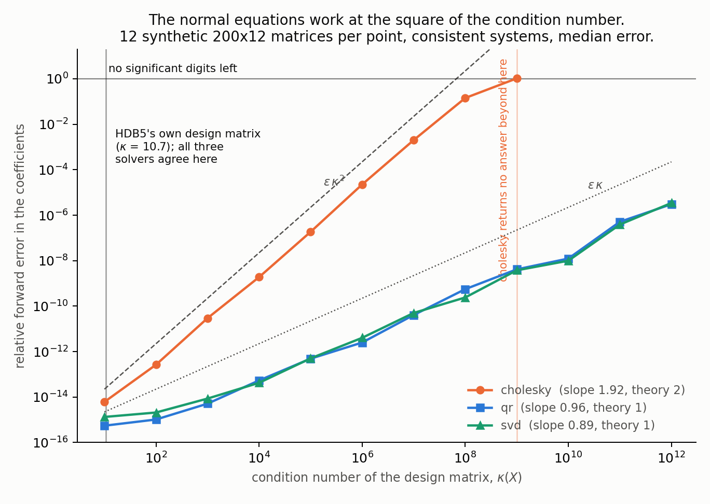
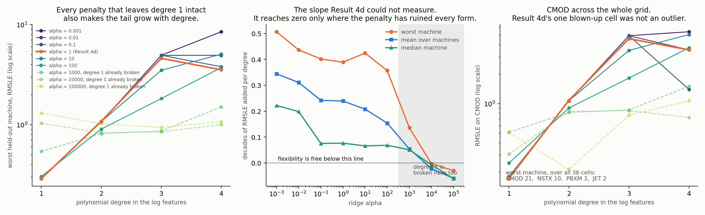

# Confinement scaling as a linear algebra problem

Seven results on the ITPA global H-mode confinement database (HDB5, standard
analysis set STD5). Results 1 to 3 are regenerated end to end by `python3
analysis_scaling_law.py`, Result 4 by `python3 analysis_extrapolation.py`,
Result 4e by `python3 analysis_flexibility_sweep.py`, Result 5 by `python3
analysis_size_extrapolation.py`, Result 6 by `python3 analysis_hybrid.py` and
Result 7 by `python3 analysis_conformal.py`.

Results 1 to 5 are a negative result: the models that win cross-validation lose
on a machine they have not seen, three separate ways. Result 6 builds the model
that diagnosis implies and finds it wins in the one direction ITER sits in.
Result 7 asks what any of them can say about their own uncertainty out there,
and the answer is the sharpest number in the document.

Three of the sections below exist because an earlier draft's own limitations
section said its conclusions were under-determined, and it was cheaper to run
the missing experiment than to keep the caveat. Result 2b reports the exponent
intervals at the resampling unit the claim is actually about, and they are 6.3x
wider than the ones first published here. Result 2c measures a numerical claim
that was previously only asserted. Result 4e turns a three-point trend into a
36-cell grid. Two of the three make this document's own headline weaker.

**Data.** 6228 quasi-stationary time slices from 4471 discharges across 18
tokamaks (JET, ASDEX Upgrade, DIII-D, JT-60U, C-Mod, NSTX, MAST, START and
others). Third-party scientific data, fetched from OSF rather than
redistributed here; `python3 hdb5.py download` retrieves it. No synthetic data
appears anywhere in this document.

Every number below is a statement about one specific file that this repository
does not contain and does not control, so that file is **pinned by content
hash**: SHA-256 `67601c2d...b9ac5b`, 879645 bytes, raw shape 6228 x 15. The
pipeline verifies it on load and refuses to run on anything else, a failed
download is discarded before it can land at the canonical path, and every
artifact under `results/` carries the digest of the bytes it was computed from.
Check it with `python3 hdb5.py verify`. Without that, "reproducible" would mean
"runs again" rather than "produces the same numbers": a silent upstream revision
would reproduce cleanly and report something different, and nothing would
notice.

## Why this is a linear algebra problem at all

A confinement scaling law is a power law,

    tau_E = C * Ip^a1 * Bt^a2 * ne^a3 * P^a4 * R^a5 * eps^a6 * kappa^a7 * M^a8

so in log space it is exactly a linear model,

    log tau_E = log C + a1 log Ip + a2 log Bt + ... + a8 log M

and fitting a scaling law is ordinary least squares on a log design matrix.
Every question about the physics becomes a question about that matrix. Results 1
to 3 are properties of that matrix rather than of any particular model. Result 4
is what those properties cost you when you try to predict a machine that is not
in it.

The published baseline is IPB98(y,2):

    tau_E = 0.0562 * Ip^0.93 * Bt^0.15 * ne19^0.41 * P^-0.69
                   * R^1.97 * eps^0.58 * kappa_A^0.78 * M^0.19

with Ip in MA, Bt in T, ne in 10^19 m^-3, P in MW, R in m. The leading
coefficient is quoted as 0.0562 in the ITER Physics Basis and rounded to 0.056
in several later summaries; we carry 0.0562 and note the difference rather than
picking one silently. It shifts log C by 0.0036, far inside the interval fitted
below, so nothing here depends on the choice. `kappa_A` is areal elongation,
which is the `KAPPAA` column of HDB5 rather than the separatrix elongation.

---

## Result 1: the model's own feature matrix is rank deficient by exactly two

The confinement model in `hdb5.py` is trained on ten log features. Standardized,
that matrix has **rank 8 of 10**, with the last two singular values at 4.9e-14
and 2.4e-14 against a numerical-zero tolerance of 2.3e-10.

Two exact dependencies, confirmed by projecting the expected vector onto the
null space (`ConditioningReport.null_space_residual`, relative norm):

| dependency | kind | residual |
|---|---|---|
| `log a = log R + log eps` | definitional: minor radius is *derived* as `a = eps * R` in cleaning | 7.3e-16 |
| `log tau_IPB98 = 0.93 log Ip + 0.15 log Bt + ... + 0.19 log M` | the IPB98 prior is a fixed log-linear combination of the other eight features | 9.9e-16 |
| `log Ip` alone (control) | not a dependency | 8.9e-01 |

The second one is the interesting one. Adding a published physics scaling as a
model feature feels like adding knowledge. In log space it provably is not: the
prior is a fixed linear combination of features the model already has, so it
contributes nothing to a log-linear fit. It does help the tree models, which
cannot form that combination themselves, and that is the honest reason to keep
it. It contributes exactly zero to the ridge model it sits beside.

**Why nothing ever crashed.** `scikit-learn`'s linear models call
`scipy.linalg.lstsq`, which inverts through the SVD pseudoinverse and returns
the *minimum-norm* solution. Of the two-parameter family of coefficient vectors
that fit identically well, it silently returns the shortest. No error, no
warning, and no metric moves. `tests/test_scaling_law.py` demonstrates this: it
takes the returned solution, adds a null-space vector, and confirms the
predictions are unchanged to 1e-9 while the coefficients are not.

### Two ways this analysis goes wrong, both of which it went wrong before

**Reading the printed basis instead of projecting.** The null space is a
*subspace*, and the SVD returns an arbitrary orthonormal basis for it. When the
deficiency is greater than one, the vectors numpy prints generally will not
resemble the dependency you are looking for even when you are exactly right. The
correct test is whether your vector lies in the span, `||v - N^T N v||`.

**Comparing vectors across coordinate systems.** Standardizing rescales the null
space. A dependency `sum_j c_j x_j = 0` among raw columns becomes `c_j * s_j`
once each column is divided by its standard deviation. Checking the raw `c`
against a standardized null space gives residuals of 0.41 and 0.96 here, for
dependencies that are exactly true. That is indistinguishable from being wrong.
Both traps are pinned down by tests.

**Standardize before reading the rank.** `numpy.linalg.matrix_rank` on the
unstandardized matrix reports rank **9**, not 8, because its tolerance scales
with the largest singular value and one column's units dominate. Reported rank
is otherwise a statement about someone's choice of SI prefix rather than about
the data.

---

## Result 2: refitting IPB98(y,2) from the database

Solved three ways, implemented from scratch in `scaling_law.py` (including the
triangular substitutions) rather than by calling `scikit-learn`. Design matrix
6228 x 9, condition number 10.7. Timings are per solve, averaged over 20 runs.

| solver | time | max deviation from the SVD solution |
|---|---|---|
| normal equations, Cholesky | 0.073 ms | 7.6e-13 |
| QR | 0.343 ms | 2.2e-15 |
| SVD pseudoinverse | 0.395 ms | 0 (reference) |

Cholesky is five times faster and three orders of magnitude less accurate, which
is the expected trade: it forms `X^T X` and therefore works at the *square* of
the condition number. At cond 10.7 that costs nothing real. It is also the only
one of the three that fails loudly on a rank-deficient matrix, which is a
feature. Result 2c below measures the squaring rather than asserting it.

Exponents, with 95% percentile bootstrap intervals over 1000 resamples,
**resampling whole discharges** rather than rows (the several time slices from
one shot are not independent observations; row-level resampling returns
intervals that are too narrow). These are the *narrowest* defensible intervals
here, and Result 2b below reports the wider ones that match what a scaling law
actually claims:

| variable | refit | 95% CI | IPB98(y,2) | published value inside CI |
|---|---|---|---|---|
| Ip | 1.080 | 1.034 to 1.130 | 0.93 | no |
| Bt | 0.120 | 0.080 to 0.163 | 0.15 | **yes** |
| ne | 0.217 | 0.190 to 0.242 | 0.41 | no |
| P | -0.688 | -0.707 to -0.672 | -0.69 | **yes** |
| R | 1.579 | 1.502 to 1.647 | 1.97 | no |
| eps | 0.167 | 0.060 to 0.264 | 0.58 | no |
| kappa | 0.898 | 0.833 to 0.966 | 0.78 | no |
| M | 0.256 | 0.221 to 0.290 | 0.19 | no |

Coefficient: 0.0548 fitted against 0.0562 published. Loss-power and toroidal
field come back essentially exactly; density, major radius and inverse aspect
ratio do not.

**Six of the eight exponents disagree with the published values under this
interval. Result 2b shows that five of those six disagreements do not survive
being asked about tokamaks rather than about discharges.**

**The disagreement that remains is expected, and pretending otherwise would be
the error.**
IPB98 was fit to a selected ITER-relevant subset under the ITPA's own standard
selection criteria. The fit above uses every STD5 row that is finite and
positive, which includes the spherical tokamaks (NSTX, MAST, START) whose
inverse aspect ratio sits far outside the conventional range, and it applies no
selection filters at all. A refit on a different population is a different
regression. The comparison is still worth making, because of Result 3.

Against the published law on the same rows, in-sample: RMSLE **0.181** for the
refit against **0.199** for IPB98(y,2). Out of sample, under grouped
cross-validation by discharge (`python3 hdb5.py evaluate`):

| model | CV RMSLE | CV R^2 (log) |
|---|---|---|
| random forest | 0.118 | 0.981 |
| histogram gradient boosting | 0.119 | 0.981 |
| ridge, log-linear | 0.181 | 0.957 |
| **IPB98(y,2), analytic, no training** | **0.199** | **0.947** |
| mean baseline | 0.869 | 0.000 |

41% lower RMSLE than the published scaling law, against a real physics baseline
rather than against the mean.

**Read that table with Result 4 in hand.** Grouped CV holds out *discharges*,
and every machine in the held-out fold also appears in the training fold. It
therefore measures interpolation within machines the model has already seen. On
the split that a scaling law actually exists for, holding out a whole device,
this ranking reverses top to bottom and the 41% becomes a 2.2x loss.

---

### Result 2b: the intervals above answer a question nobody asked

A confidence interval is a statement about a population, and which population
depends entirely on what the bootstrap is allowed to shuffle. This database is
not a sample of independent measurements. Its 6228 rows come from 18 `TOK`
labels that are 16 physical devices, and **JET and ASDEX Upgrade supply 4772 of
those rows, 77%**. Three nested resampling units are defensible, and they answer
three different questions:

| unit | count | the question it answers |
|---|---|---|
| discharge | 4471 | another shot on *these* machines |
| machine | 18 | another tokamak, counting JET and JET-with-the-ITER-like-wall as two |
| device | 16 | another tokamak, with the wall variants folded back together |

Row-level resampling is not offered at all: the time slices from one shot are
near-copies, so treating rows as independent returns intervals several times too
narrow, and there is no question it correctly answers.

The distinction between *machine* and *device* is not bookkeeping. `JETILW` is
JET after the ITER-like-wall retrofit and `AUGW` is ASDEX Upgrade after
tungsten. The database is right to separate them, because the wall changes the
confinement physics, but they are one tokamak each, so resampling them
independently draws JET twice and calls it two devices.

Same estimator, same percentile method, same features. Only the resampling unit
changes:

| exponent | discharge 95% | machine 95% | device 95% | device wider by |
|---|---|---|---|---|
| log C | -2.968 to -2.839 | -3.316 to -2.371 | -3.343 to -2.452 | 6.9x |
| Ip | +1.034 to +1.130 | +0.712 to +1.319 | +0.684 to +1.390 | 7.4x |
| Bt | +0.079 to +0.163 | -0.125 to +0.384 | -0.133 to +0.449 | 7.0x |
| ne | +0.190 to +0.242 | +0.064 to +0.377 | +0.082 to +0.407 | 6.3x |
| P | -0.707 to -0.672 | -0.737 to -0.587 | -0.753 to -0.547 | 5.9x |
| R | +1.502 to +1.647 | +1.131 to +2.035 | +1.180 to +2.132 | 6.6x |
| eps | +0.060 to +0.264 | -0.331 to +0.794 | -0.313 to +0.948 | 6.2x |
| kappa | +0.833 to +0.966 | +0.437 to +1.322 | +0.520 to +1.298 | 5.9x |
| M | +0.221 to +0.290 | +0.034 to +0.356 | +0.040 to +0.364 | 4.7x |

**Median widening, device against discharge: 6.3x.** Nothing about the fit
changed. The fitted exponents in the Result 2 table are still the fitted
exponents. What changed is the honest width of the uncertainty around them.

**The consequence lands on Result 2's headline.** Under discharge resampling,
the published IPB98(y,2) exponent falls inside the refit interval for **2 of the
8** exponents, Bt and P. Under device resampling it falls inside for **7 of 8**.
The refit does not, in fact, contradict the published law about Ip, R, eps,
kappa or M. It contradicts it about what *these particular 16 tokamaks* did, and
the moment the question becomes "would another tokamak have given these
exponents", five of the six disagreements dissolve. **Only the density exponent
survives**, and it survives narrowly: published 0.41 against a device interval
reaching 0.407.

The intercept is excluded from those counts because the ITER Physics Basis
quotes a multiplying coefficient rather than a log-intercept, so there is no
published value to test containment against. For the record, `log(0.0562)` is
-2.879, which is inside the device interval of -3.343 to -2.452 and outside the
discharge interval of -2.968 to -2.839. The coefficient disagreement goes the
same way as the rest.

This is the wrong direction for the narrative and it is reported anyway, because
the alternative is quoting a 6x-too-narrow interval to make a refit look more
decisive than the data supports. The population a scaling law is written about
is tokamaks, not shots.

A caveat on the wide interval, in the other direction: 16 units resampled with
replacement is a small bootstrap, its tails are poorly determined, and a draw
that omits JET is a genuinely different regression rather than a perturbation of
this one. The device interval is the right *question*; it is not a precise
answer, and it should not be read as one.

---

### Result 2c: the squared condition number, measured on these solvers

Result 2 asserts that the normal equations work at `cond(X)^2` while QR and the
SVD work at `cond(X)`. That is a textbook statement, and quoting it proves
nothing about the code in `scaling_law.py`. Since the three solvers agree to
7.6e-13 on the real design matrix, the repository has, on its own evidence, no
demonstration that they differ at all.



So: build design matrices with *known* conditioning, which real data cannot
supply. Draw random orthonormal `U` and `V`, place 12 singular values
geometrically between 1 and `1/kappa`, set `X = U S V^T`, and take
`y = X b_true` exactly. The system is consistent and noiseless, so every solver
has the same exact answer to find and the only thing separating them is
arithmetic. Sweep `kappa` from 1e1 to 1e12, 12 matrices of 200 x 12 at each, and
fit the slope of `log10(forward error)` against `log10(kappa)` over the band
where the error is conditioning-limited rather than at the noise floor or
saturated at O(1):

| solver | fitted slope | theory | breaks down at |
|---|---|---|---|
| normal equations, Cholesky | **1.92** | 2 | kappa = 1e9 |
| QR | **0.96** | 1 | not within the sweep |
| SVD pseudoinverse | **0.89** | 1 | not within the sweep |

The slopes come out at 2, 1 and 1. Cholesky's error crosses 1e-8 at
`kappa` = 1e4, where QR and SVD are still at 1e-13, and by `kappa` = 1e9 the
Gram matrix is no longer numerically positive definite and `solve_lstsq_cholesky`
raises rather than returning a number. **Raising is the correct behaviour and is
why the orange curve stops**: an exception is a better outcome than a confident
answer with no significant digits in it, which is what a solver that pressed on
would produce.

Two things follow, and the second is the one that matters here.

First, the from-scratch implementations are correct. A `solve_lstsq_cholesky`
that quietly delegated to a stable factorization would land on slope 1, and a
`solve_lstsq_qr` that secretly formed `X^T X` would land on slope 2. Neither
does. `tests/test_solver_conditioning.py` asserts the separation.

Second, and this is the caveat rather than the boast: **the vertical line at
kappa = 10.7 is where HDB5's own design matrix sits**, at the far left of the
sweep, in the regime where all three solvers are accurate to 1e-13 and the
choice between them genuinely does not matter. The agreement reported in Result
2 is a fact about an easy matrix, not evidence that the solver is a free choice.
Result 3's shrinkage analysis runs on a matrix with condition number 10.7 as
well. It is the *degree 3 and 4 polynomial expansions* in Result 4e, at 219 and
714 terms with exact collinearities in them, where this stops being academic,
and those are fitted through the SVD for exactly this reason.

---

## Result 3: the disagreement lives where the data is blind


The design matrix is **not** ill conditioned: cond 10.7, which is unremarkable.
So the individual exponents are determined, and the interesting question is not
whether but *where* the refit and IPB98 part ways.

Decomposing the difference between the two exponent vectors along the singular
directions of the design matrix (after mapping into standardized coordinates,
where the singular vectors live):

| direction | singular value | share of what the data determines | share of the disagreement |
|---|---|---|---|
| 1 | 135.6 | 36.9% | 0.6% |
| 2 | 114.6 | 26.4% | 0.1% |
| 3 | 95.5 | 18.3% | 0.1% |
| 4 | 63.6 | 8.1% | 1.8% |
| 5 | 50.1 | 5.0% | 2.3% |
| 6 | 38.2 | 2.9% | 10.6% |
| 7 | 31.7 | 2.0% | 7.1% |
| **8** | **12.7** | **0.3%** | **77.4%** |

**77% of the disagreement lies in the single weakest direction, which carries
0.3% of the design matrix's variance.** The three strongest directions carry 82%
of the variance and account for 0.75% of the disagreement. The two laws agree on
essentially everything the database determines well and differ almost entirely
in the combination it barely constrains.

That weakest direction is

    -0.62 log Ip + 0.55 log R + 0.43 log eps + 0.29 log Bt + ...

which is plasma current traded against machine size. It is weak for a structural
reason rather than a statistical one: tokamaks are not designed to vary current
and major radius independently, so no amount of additional shots from existing
machines separates them. This is why published scaling laws can disagree
noticeably on individual exponents while predicting almost identically over the
range where they were fit, and it is a known problem in the field rather than an
artifact here.

Ridge regression makes the same point constructively. Written through the SVD,
ridge multiplies each singular direction by `s^2 / (s^2 + alpha)`:

| direction | singular value | alpha = 1 | alpha = 100 |
|---|---|---|---|
| 1 | 135.6 | 0.99995 | 0.995 |
| 7 | 31.7 | 0.999 | 0.909 |
| 8 | 12.7 | 0.994 | **0.616** |

At alpha = 100 the seven well-determined directions are untouched and the weak
one is shrunk by 38%. Regularization is not a knob that makes numbers behave. It
is a decision about which physics you are declining to resolve, and the SVD says
exactly which.

---

---

## Result 4: the model that wins on cross-validation loses on a new machine

Results 1 to 3 are about a matrix built from 18 existing tokamaks. A confinement
scaling law is not for those machines. It is for the next one, and every number
above is quoted under grouped cross-validation by *discharge*, which holds out
some shots from JET and then trains on the rest of JET. Every machine in the
held-out fold also sits in the training fold. That measures interpolation.

So hold out an entire device. Train on 12 tokamaks, predict the 13th, rotate.
Regenerate with `python3 analysis_extrapolation.py`, or `python3 hdb5.py
extrapolate` for the table alone.


**Both columns below use the same nine features and the same models.** The only
thing that changes is what the split holds out. That is also why the CV column
here reads 0.128 for the random forest where Result 2 reported 0.118: Result 2
scores the full ten-feature set, this scores the nine blind ones. Dropping the
IPB98 prior costs the forest 0.010 RMSLE, which is the honest size of what that
feature was contributing and is an order of magnitude smaller than the effect
being measured. That matters more than it might
look: the model's default feature set includes the analytic IPB98 prior, whose
exponents were fitted on this database *including whichever machine is held
out*, so leaving it in would leak the answer into every fold. Dropping it only
in the extrapolation arm would then confound the feature set with the split, so
it is dropped from both (`hdb5.BLIND_FEATURE_COLUMNS`).

| model | CV, by discharge | leave-one-tokamak-out | 95% interval | ratio | CV rank | LOMO rank |
|---|---|---|---|---|---|---|
| random forest | 0.128 | 0.465 | [0.376, 0.560] | **3.6x worse** | 1 | 5 |
| histogram gradient boosting | 0.130 | 0.359 | [0.279, 0.442] | 2.8x worse | 2 | 4 |
| ridge, log-cubic (control) | 0.148 | 0.849 | [0.299, 1.593] | 5.7x worse | 3 | 6 |
| ridge, log-quadratic (control) | 0.158 | 0.300 | [0.206, 0.443] | 1.9x worse | 4 | 3 |
| ridge, log-linear | 0.181 | 0.214 | [0.183, 0.241] | 1.2x worse | 5 | 2 |
| IPB98(y,2), analytic* | 0.199 | 0.188 | [0.158, 0.219] | 1.0x, unchanged | 6 | 1 |
| mean baseline | 0.869 | 0.994 | [0.780, 1.218] | 1.1x worse | 7 | 7 |

Intervals are 95% percentile bootstrap over **machines**, 2000 resamples. The
sampling unit has to be the tokamak: the claim is about behaviour on an unseen
machine and there are only 13 of them, so resampling rows would give intervals
that are far too narrow. Thirteen units is a small sample and these intervals
are correspondingly wide, which is the honest picture rather than a defect.

They also overlap, so the ranking above is not by itself established by them.
The machines differ enormously in difficulty, and that shared difficulty is
common to every model, so the marginal intervals are the wrong test. Resampling
the *paired* per-machine difference removes it:

| gap | mean | 95% interval | machines where the first is worse |
|---|---|---|---|
| random forest - ridge log-linear | +0.251 | [+0.157, +0.342] | **13 of 13** |
| hist gradient boosting - ridge log-linear | +0.145 | [+0.070, +0.223] | 12 of 13 |
| random forest - ridge log-quadratic | +0.165 | [+0.013, +0.302] | 12 of 13 |
| ridge log-quadratic - ridge log-linear | +0.086 | [-0.013, +0.237] | 5 of 13 |

The random forest is worse than the log-linear power law on **every single
machine**, and the interval on that gap is nowhere near zero. The last row is
the one that does not hold up, and Result 4d is about why.

\* not a blind baseline: IPB98's exponents were fitted on this database, held-out
machine included. It is a reference point for what a power law achieves here,
not a competitor that never saw the data. The ranking claim below is about the
three models that actually fit something and are genuinely blind; the two
polynomial rows are controls introduced in Result 4d and are likewise excluded
from it.

**Among those three, the order under one split is the exact reverse of the order
under the other** (rho = -1.00; with three contenders the reversal itself is the
statistic worth quoting, not the correlation). The random forest is the best
model in the repository by cross-validation and the worst of the three on a
machine it has not seen. Its 41% margin over the published scaling law in Result
2 is not a margin over the published scaling law. It is a measurement of how
much of JET is predictable from the rest of JET.

### Result 4b: the trees fail as a function of distance, and the power law does not

Per machine, ordered by how far it sits outside the training data (Mahalanobis
distance of its mean log-feature vector from the training mean, in training
covariance units, via the pseudo-inverse because that covariance is singular by
Result 1):

| held out | rows | distance | IPB98 | ridge | hist GB | random forest |
|---|---|---|---|---|---|---|
| D3D | 388 | 1.1 | 0.252 | 0.251 | 0.246 | 0.406 |
| AUG | 1377 | 1.2 | 0.197 | 0.216 | 0.281 | 0.279 |
| AUGW | 767 | 1.6 | 0.218 | 0.207 | 0.212 | 0.219 |
| JETILW | 866 | 1.7 | 0.257 | 0.216 | 0.244 | 0.318 |
| JET | 1762 | 2.2 | 0.148 | 0.198 | 0.487 | 0.478 |
| JT60U | 100 | 2.5 | 0.275 | 0.285 | 0.307 | 0.291 |
| PDX | 97 | 4.0 | 0.227 | 0.233 | 0.323 | 0.407 |
| ASDEX | 431 | 5.2 | 0.131 | 0.194 | 0.207 | 0.507 |
| MAST | 39 | 5.4 | 0.136 | 0.154 | 0.317 | 0.581 |
| JFT2M | 69 | 5.4 | 0.095 | 0.094 | 0.234 | 0.450 |
| CMOD | 45 | 6.9 | 0.119 | 0.173 | 0.569 | 0.521 |
| NSTX | 185 | 7.8 | 0.222 | 0.289 | 0.686 | 0.857 |
| PBXM | 59 | 10.2 | 0.172 | 0.274 | 0.559 | 0.727 |

Rank correlation between a model's per-machine error and that distance:

| model | rho |
|---|---|
| random forest | **+0.85** |
| ridge, log-cubic (control) | +0.57 |
| histogram gradient boosting | +0.54 |
| ridge, log-quadratic (control) | +0.25 |
| ridge, log-linear | **-0.06** |
| IPB98(y,2), analytic | -0.49 |

The random forest's errors are explained by extrapolation distance. The power
law's are not: at rho = -0.06 its error is uncorrelated with how far the machine
sits from anything it was trained on. On the four most distant machines (MAST,
CMOD, NSTX, PBXM, all of them small or spherical) the forest is 2.6x to 3.8x the
power law's error; on the four nearest it is within 1.6x.

This column does increase with model flexibility, and the temptation is to read
that as "flexible models extrapolate worse, in proportion to how flexible they
are". Result 4d shows that reading does not survive contact with the medians:
what rises with flexibility is the *tail* of the error distribution, not its
centre.

### Result 4c: one of the two failure modes is a hard bound, not a shortfall

JET is the visible outlier in the right panel: close to the training
distribution, badly predicted by the trees. That is a second, separable failure
mode.

A tree ensemble predicts by averaging training targets, so **every prediction it
can possibly make lies inside `[min(y_train), max(y_train)]`**, whatever the
features say. When JET is held out, 48% of its rows have confinement times above
the maximum in the remaining 12 machines, and its best shot is **3.7x above
anything any tree in the forest is able to output**. JET is the largest device in
the database, so the rest of the database does not contain its performance
envelope. The forest scores 0.478 there against the power law's 0.198.

This is not a shortfall that more data or better features would close. It is the
functional form. `tests/test_extrapolation.py` asserts the bound directly, by
fitting a forest with a machine held out and checking no prediction exceeds the
training maximum while the held-out truth does.

### Result 4d: the constraint buys variance, not accuracy

Ridge beating the trees on an unseen machine has two candidate explanations, and
the model zoo above cannot tell them apart:

1. the log-linear power-law form is close to physically right, or
2. ridge is simply the only model in the zoo that extrapolates *at all*, since a
   tree ensemble is bounded by its training range by Result 4c.

The discriminating case is a model that is far more flexible than plain ridge
but still extrapolates. Polynomials in the log features are exactly that, so the
ladder is degree 1 (plain ridge), degree 2 and degree 3 (`hdb5.build_control_models`
and `analysis_extrapolation.build_flexibility_ladder`; degree 3 expands nine
features to 219 terms). The tree ensembles are the nonparametric end.

| form | median | mean | worst machine | degradation | rho(distance) |
|---|---|---|---|---|---|
| log-linear (degree 1) | 0.216 | 0.214 | 0.289 (NSTX) | 1.18x | -0.06 |
| log-quadratic (degree 2) | 0.238 | 0.300 | **1.083** (C-Mod) | 1.89x | +0.25 |
| log-cubic (degree 3) | 0.295 | 0.849 | **4.601** (C-Mod) | 5.74x | +0.57 |
| gradient-boosted trees | 0.307 | 0.359 | 0.686 (NSTX) | 2.77x | +0.54 |
| random forest | 0.450 | 0.465 | 0.857 (NSTX) | 3.64x | +0.85 |

**The obvious reading of this table is wrong, and the medians are what give it
away.** Degree 2 is not meaningfully worse than degree 1 on a typical machine.
Its median is 0.238 against 0.216, it is actually *better* on 8 of the 13
machines, and the paired interval on the gap is [-0.013, +0.237], which contains
zero. Extra flexibility is not costing accuracy in the middle of the
distribution. On the four machines closest to the training data it is a small
improvement.

What flexibility costs is the **tail**. Degree 1's worst machine out of thirteen
is 0.289, barely worse than its best at 0.094: it is nearly as accurate on the
machines it has never seen anything like as on the ones it has. Degree 2's worst
is 1.083 and degree 3's is 4.601, both on C-Mod, a compact high-field machine far
from the training set. A polynomial extrapolates without bound in *every*
direction including the weakly-determined one from Result 3, so away from the
data its curvature terms are free to diverge, and on C-Mod they do. The mean is
dragged around by that one machine, which is why the median and the worst case
are reported next to it rather than the mean alone.

So the answer to the question is neither of the two candidates as posed. The
log-linear form is not winning because it is more accurate. It is winning
because it is the only form on the ladder whose error is bounded in practice,
and the constraint is buying variance rather than bias.

**The trees make the same point from the other side.** Degree 3 is the most
accurate model in the table on a typical machine after degree 1 and 2 (median
0.295, better than either tree ensemble), and the worst model in the table
overall (mean 0.849). Its problem is entirely the tail. The tree ensembles are
mediocre everywhere but never catastrophic: their worst cases, 0.686 and 0.857,
are well below degree 3's 4.601. That is not a coincidence and not a virtue of
trees as models. **It is the Result 4c bound seen from the other direction.**
The same ceiling that makes a forest unable to predict JET at all also caps how
wrong it is allowed to be on C-Mod. Boundedness is simultaneously the reason
they cannot extrapolate and the reason they cannot blow up.

For a next-step device you get one machine and one shot at it, so the relevant
statistic is the tail rather than the average, and the only model here with a
tail worth relying on is the constrained power law. Unbounded extrapolation is
not a virtue on its own. It is useful only along a form the physics constrains.

All three failure modes point the same way, and it is the same way Result 3
points. A power law is not used in this field because it fits better; Result 2
shows it fits worse. It is used because it is the functional form that survives
leaving the data behind. ITER's major radius is 6.2 m against 3.40 m for the
largest row in this table, a factor of 1.8 beyond anything here, and Result 5
measures what happens at exactly that factor.

---

### Result 4e: flexibility is a family, and the whole family degrades

Result 4d is three points and one penalty: degrees 1, 2 and 3, all at ridge
`alpha = 1.0`. That is enough to observe that the tail grows and not enough to
claim it must. Two objections survive it, and both are fatal to the conclusion
as stated:

1. **A larger penalty might rescue the flexible forms.** Degree 2's divergence
   on C-Mod is its curvature terms running away in an unconstrained direction.
   Shrinking those terms harder is exactly what ridge does. Nothing in Result 4d
   rules out that degree 2 at `alpha = 100` matches degree 1 everywhere.
2. **Three points have no slope.** "The tail grows with flexibility" was read
   off 0.289, 1.083, 4.601, which is also consistent with degree 2 being fine
   and degree 3 being a one-off.

So run the grid: degrees 1 to 4 crossed with nine decades of penalty, 36 models,
each scored under both grouped CV and leave-one-tokamak-out on the same 13
machines and the same blind features as Result 4. Degree 4 expands nine log
features to 714 terms. `alpha = 1.0` reproduces Result 4d's table exactly, which
is the cross-check that the grid is the same family of models
(`tests/test_flexibility_sweep.py` pins it against the scikit-learn pipelines).



Worst held-out machine, RMSLE. The `alpha = 1` column is Result 4d:

| degree | terms | a=1e-3 | a=1e-2 | a=0.1 | **a=1** | a=10 | a=100 | a=1e3 | a=1e4 | a=1e5 |
|---|---|---|---|---|---|---|---|---|---|---|
| 1 | 9 | 0.289 | 0.289 | 0.289 | **0.289** | 0.289 | 0.304 | 0.541 | 1.033 | 1.309 |
| 2 | 54 | 1.069 | 1.070 | 1.072 | **1.083** | 1.074 | 0.905 | 0.815 | 0.833 | 1.022 |
| 3 | 219 | 4.931 | 4.922 | 4.939 | **4.601** | 3.495 | 1.824 | 0.864 | 0.850 | 0.937 |
| 4 | 714 | 8.476 | 4.937 | 3.792 | **3.536** | 5.064 | 3.718 | 1.507 | 1.003 | 1.074 |

**The first objection is answered directly, and the answer is no.** Giving each
degree the penalty that minimises its *own* worst machine, chosen with hindsight
on the very machines it is then scored on:

| degree | best alpha | worst machine | mean | vs degree 1 |
|---|---|---|---|---|
| 1 | 1e-3 | **0.289** | 0.214 | 1.00x |
| 2 | 1e3 | 0.815 | 0.288 | **2.82x** |
| 3 | 1e4 | 0.850 | 0.389 | **2.94x** |
| 4 | 1e4 | 1.003 | 0.418 | **3.47x** |

That selection rule is not a defensible procedure and is not meant to be. It is
an *optimistic bound*: it hands the flexible forms the answer key. **0 of 3
match degree 1's tail even so.** Best case, degree 2 is 2.8x worse in the tail
than the plain power law, and every one of those best cases sits at a penalty
(`alpha` >= 1e3) that would itself have broken degree 1, which had already
degraded from 0.289 to 0.541 there. The flexible forms only become tolerable at
a shrinkage that destroys the baseline.

**The second objection is answered with a slope.** Fitting
`log10(RMSLE)` against degree at each penalty gives the multiplicative cost per
degree of freedom added:

| alpha | worst machine | mean | median | degree 1's own worst |
|---|---|---|---|---|
| 1e-3 | 3.21x | 2.21x | 1.67x | 0.289 |
| 1e-2 | 2.73x | 2.04x | 1.58x | 0.289 |
| 0.1 | 2.52x | 1.75x | 1.19x | 0.289 |
| **1** | **2.45x** | **1.73x** | **1.19x** | 0.289 |
| 10 | 2.66x | 1.61x | 1.16x | 0.289 |
| 100 | 2.27x | 1.43x | 1.17x | 0.304 |
| 1e3 | 1.37x | 1.13x | 1.12x | 0.541 (broken) |
| 1e4 | 0.99x | 0.95x | 0.98x | 1.033 (broken) |
| 1e5 | 0.93x | 0.87x | 0.87x | 1.309 (broken) |

**Over the six penalties that leave degree 1 intact, the worst held-out machine
grows by 2.27x to 3.21x per degree.** The slope is positive across five decades
of regularization and never dips below 2.2x. Result 4d's "flexibility costs the
tail" is a real trend, not an artifact of the one penalty it happened to report.

The slope does reach zero, at `alpha` >= 1e4, and the last column is why that
does not count. At those penalties degree 1's own worst machine has gone from
0.289 to 1.033: the penalty has not made flexibility free, it has shrunk every
model onto the intercept, where they are all equally useless and therefore
equally flat. That region is shaded in the middle panel. Reporting the crossing
without the last column would be the most flattering possible misreading of this
grid, so both are shown.

Notice also that the *median* column barely moves, 1.12x to 1.67x against the
worst machine's 2.27x to 3.21x. That is Result 4d's central finding surviving
the sweep intact: flexibility is roughly free in the middle of the distribution
and expensive in the tail, at every penalty.

**And the C-Mod blowup is a trend, not one machine misbehaving.** Result 4d's
1.083 is a single cell, and a single cell is always a candidate outlier. Across
all 36 cells, the machine that defines the tail is **C-Mod in 21, NSTX in 10,
PBX-M in 3 and JET in 2**, and the split by degree is the informative part:

| worst machine | degree 1 | degree 2 | degree 3 | degree 4 |
|---|---|---|---|---|
| C-Mod | 0 | 8 | 8 | 5 |
| NSTX | 8 | 0 | 1 | 1 |
| PBX-M | 0 | 0 | 0 | 3 |
| JET | 1 | 1 | 0 | 0 |

**C-Mod defines the tail in 0 of the 9 degree-1 cells and 21 of the 27 cells
above it.** It is not a machine that is hard for everything; it is the machine
that a flexible model breaks on, and it starts breaking the moment curvature
terms are introduced. Its own RMSLE rises monotonically from degree 1 to degree
3 at every one of the six penalties that leave degree 1 intact, from 0.17 to 4.9
at the light end.

Degree 4 breaks that monotonicity at three of those six, landing below degree 3
rather than above it, and that is worth stating rather than smoothing over: at
714 terms on 6228 rows the fit is unstable enough that its tail bounces rather
than climbing cleanly. Degree 4 is evidence for the trend in aggregate, not a
clean fourth point on a line.

C-Mod is a compact high-field machine sitting far outside the training
distribution in exactly the weakly-determined direction Result 3 identified, and
what happens to it is what a polynomial does away from its data. It is not an
anomaly in the database; it is the mechanism, visible.

One thing this sweep does not do: it varies flexibility only along the
polynomial-degree axis, with an isotropic L2 penalty. It says nothing about
whether a *differently* constrained flexible form -- a Gaussian process with a
physically chosen kernel, a monotonicity constraint, a penalty aimed at the
weak direction from Result 3 specifically -- would behave the same way. The
claim supported here is narrower than "flexibility is bad": it is that adding
unconstrained polynomial freedom, at any isotropic shrinkage, costs the tail.

---

## Result 5: the same jump ITER asks for, measured inside the database

Result 4 holds out one machine at a time, and the last of its limitations is
that this still is not the question. Holding out JET leaves twelve tokamaks
spanning much of its parameter range, so the model extrapolates in *identity*
while interpolating in *size*. A next-step device is not that case. ITER's major
radius is 6.2 m; the largest row here is JT-60U at 3.40 m. Nothing in this
database is within a factor of 1.8 of it.

That factor is the whole point, and it turns out to be available. Order the
machines by size, cut, train below the cut and predict every machine above it.
Sweeping the cut sweeps the size extrapolation demanded, and one rung reproduces
the ITER jump almost exactly:

    train on the 14 smallest machines   up to R = 1.865 m (DIII-D)   3498 rows
    predict the 4 largest               up to R = 3.400 m (JT-60U)   2730 rows
    ratio 1.823        against ITER / this database = 1.824

The two agree to 0.03% in log terms. **The database contains, inside itself, a
size extrapolation the same size as the one that separates it from ITER.** The
rung is picked by proximity to that ratio rather than by eye, so it moves on its
own if the database ever gains a larger machine. Regenerate with `python3
analysis_size_extrapolation.py`, or `python3 hdb5.py size-extrapolate` for the
table alone.


### Result 5a: at the ITER jump the trees are closer to a constant than to the power law

The same models and the same nine blind features under three questions of
increasing difficulty. Only the held-out unit changes: a shot, then a machine,
then every machine larger than anything in training.

| model | held-out shot | held-out machine | machine larger than any in training | ratio | skill |
|---|---|---|---|---|---|
| IPB98(y,2), analytic* | 0.199 | 0.188 | **0.194** | 0.98 | 1.00 |
| ridge, log-linear | 0.181 | 0.214 | **0.278** | 1.53 | 0.93 |
| random forest | 0.128 | 0.465 | **0.938** | 7.34 | 0.41 |
| histogram gradient boosting | 0.130 | 0.359 | **1.072** | 8.27 | 0.31 |
| mean baseline | 0.869 | 0.994 | 1.459 | 1.68 | 0.00 |

\* not blind: IPB98's exponents were fitted on this database including the
held-out machines. It is the reference for what a power law achieves here, not a
competitor. `skill` places each model between the mean baseline at 0.0 and that
analytic reference at 1.0.

**The power law keeps 93% of the way from a constant predictor to the analytic
law. The trees keep 31% and 41%.** Read down the last column instead: the
histogram gradient booster scores 1.072 where predicting a single constant
scores 1.459. The best cross-validated models in this repository, asked the
question a scaling law exists to answer, land closer to a constant than to the
power law they beat by 41% in Result 2.

The escalation is the point. Ridge degrades by 1.53x from shot to size cut and
IPB98 by 0.98x, meaning it does not degrade at all. The trees degrade by 7.3x
and 8.3x. Nothing about the models changed across those three columns; only the
question did.

Per held-out machine, since 1762 of the 2730 held-out rows are JET:

| held out | rows | IPB98 | ridge | hist GB | random forest |
|---|---|---|---|---|---|
| JET | 1762 | 0.148 | 0.223 | 1.205 | 1.063 |
| JETILW | 866 | 0.257 | 0.346 | 0.780 | 0.660 |
| JT60U | 100 | 0.275 | 0.440 | 0.700 | 0.563 |

The ordering is the same on all three, so the pooled number is not an artifact
of JET's weight. (TFTR is in the held-out set with 2 rows and is not scored
separately.) Ridge degrades smoothly with distance, from 0.223 on JET to 0.440
on JT-60U, which is the behaviour a power law should have. The trees are worst
on JET, the machine whose confinement times run furthest above the training
range, which is Result 5c.

### Result 5b: it is size, not plasma shape

The obvious objection is that the small machines are not merely small. START,
MAST and NSTX are spherical, at inverse aspect ratios near 0.7 against a
conventional 0.3, and being small they sit in the training set of every size cut.
The models might be failing to extrapolate in *shape* rather than in size.

Drop them and rerun the same cut:

| model | all machines | spherical tokamaks removed |
|---|---|---|
| IPB98(y,2), analytic | 0.194 | 0.194 |
| ridge, log-linear | 0.278 | 0.256 |
| random forest | 0.938 | 0.936 |
| histogram gradient boosting | 1.072 | 1.047 |
| mean baseline | 1.459 | 1.410 |

Nothing moves. Ridge improves slightly, which is what a more homogeneous
training population should do, and the trees are unchanged to the third decimal.
The failure is about size.

### Result 5c: the Result 4c bound, now binding on a third of the rows at once

Result 4c showed that a tree ensemble averages training targets, so every
prediction it can make lies inside `[min(y_train), max(y_train)]`, and that when
JET is held out 48% of its rows sit above that ceiling. Under leave-one-out that
bites on one machine. Under a size cut it bites on the entire held-out set,
because confinement time rises steeply with machine size and the held-out
machines are by construction the large ones.

At the ITER-matched cut, **930 of 2730 held-out rows (34%) lie above the highest
confinement time in the training set**, and the best held-out shot is **3.9x
above anything any tree in the forest is able to output**. That is why the trees
land near the mean baseline rather than merely behind the power law: for a third
of the test set they are not making a bad prediction, they are making the
largest prediction available to them and it is still far too small.

This is the mechanism that makes Result 5a structural rather than a matter of
tuning. No amount of trees, depth or data inside the training range moves that
ceiling.

### Result 5d: the whole sweep, not one lucky cut

The ITER-matched rung is one point of a sweep across every usable cut. The right
panel of the figure shows all of them. Across the well-powered cuts, spanning
size ratios from 1.13 to 2.03, the analytic power law stays flat near 0.20 and
ridge between 0.23 and 0.28, while both tree ensembles sit between 0.9 and 1.7,
at or above the mean baseline, at every cut past the smallest.

Beyond a ratio of about 2.4 the training set falls below 1000 rows, and a model
failing there could be failing on sample size rather than on size extrapolation.
Those cuts are plotted but not joined, and no claim rests on them. The
ITER-matched cut trains on 3498 rows and is comfortably clear of that band.


## Result 6: a model that is flexible in range and still extrapolates

Results 4 and 5 diagnose a failure and stop there, which is half a project. The
diagnosis is specific enough to imply a cure: Result 4d says the problem is
functional form rather than flexibility as such, and Result 4c says a tree
ensemble's boundedness is what stops it reaching a bigger machine. So build the
model those two results imply. Fit the log-linear power law, learn a correction
on its **log residuals**, and damp that correction by a factor `lambda`:

    log tau = [ power law ]  +  lambda * [ correction fitted on the residuals ]

At `lambda = 0` this is exactly `ridge_loglinear`, bit for bit, so the sweep is
anchored on a model Results 2 and 4 already report rather than on a new family.
At `lambda = 1` the correction is undamped. In between, the base term keeps the
power law's unbounded log-linear behaviour in size while the correction picks up
whatever in-range structure the power law misses. Regenerate with `python3
analysis_hybrid.py`.

Two correction families, chosen because they differ in exactly the property
Result 4c cares about:

| correction | form | extrapolates how |
|---|---|---|
| polynomial | degree-2 log expansion, ridge alpha 1000 | **unbounded**; curvature terms are free to diverge away from the data |
| boosted trees | depth 2, 200 rounds, l2 = 10 | **bounded** by the residual range it was trained on, by the Result 4c argument |


### Result 6a: on leave-one-out alone there is no free lunch, and the mean hides that

The boosted-tree family, every rung, same nine blind features and same splits as
Result 4:

| lambda | CV | LOMO mean | LOMO median | LOMO worst | ITER-matched cut | rho(distance) |
|---|---|---|---|---|---|---|
| 0 (plain ridge) | 0.181 | 0.214 | 0.216 | 0.289 | 0.278 | -0.06 |
| 0.1 | 0.177 | 0.215 | 0.215 | 0.284 | 0.269 | -0.09 |
| 0.2 | 0.173 | 0.217 | 0.215 | 0.283 | 0.260 | +0.08 |
| 0.3 | 0.169 | 0.220 | 0.215 | 0.281 | 0.252 | +0.15 |
| 0.4 | 0.166 | 0.223 | **0.215** | **0.280** | 0.244 | +0.21 |
| 0.5 | 0.163 | 0.226 | 0.218 | 0.283 | 0.237 | +0.28 |
| 0.6 | 0.160 | 0.229 | 0.224 | 0.307 | 0.230 | +0.31 |
| 0.8 | 0.155 | 0.237 | 0.228 | 0.354 | 0.217 | +0.34 |
| 1.0 | 0.151 | 0.246 | 0.233 | 0.401 | **0.206** | +0.49 |

Read the mean column alone and the answer is the boring one: cross-validated
error falls monotonically, held-out-machine error rises monotonically, and the
gain is paid for. That reading is incomplete for the same reason Result 4d's
was. **The median does not move at all until `lambda` passes 0.4**, and at that
rung the worst machine of the thirteen is 0.280 against plain ridge's 0.289.
Through the first half of the sweep the hybrid is better than plain ridge on a
typical machine and on the worst one, and its mean is worse. The mean is being
moved by a few machines, not by the middle of the distribution.

Paired by machine against plain ridge, 2000 resamples over the 13 machines:

| rung | mean gap | 95% interval | machines where the hybrid is worse |
|---|---|---|---|
| lambda = 0.3 | +0.006 | [-0.003, +0.017] | 5 of 13 |
| lambda = 1.0 | +0.032 | [-0.002, +0.075] | 5 of 13 |

Both intervals contain zero and the hybrid is better on 8 of 13 machines at
every rung. **That is not strong evidence of no cost.** Thirteen units is a
small bootstrap, the interval at `lambda = 1` only barely contains zero, and the
degradation is monotone across all nine rungs, which is a consistency no single
interval captures. The honest summary is that leave-one-out cannot resolve a gap
this size, not that the gap is zero.

### Result 6b: the damping factor has to be chosen on the split you can compute

`lambda` is a hyperparameter, and the only split a team actually has is grouped
CV by discharge. Selecting on leave-one-out would be selecting on the test set.
So the reported rung is whichever CV picks, and its out-of-distribution score is
whatever it happens to be:

| family | CV picks | CV | LOMO | ITER-matched cut |
|---|---|---|---|---|
| boosted-tree correction | lambda = 1.0 | 0.151 (ridge 0.181) | 0.246 (ridge 0.214) | **0.206** (ridge 0.278) |
| polynomial correction | lambda = 1.0 | 0.171 | 0.235 | 0.356 |

CV picks the least damped rung in both families, because damping can only hurt
in-distribution fit. The rung that is best on leave-one-out is `lambda = 0`,
plain ridge, and **nothing in the CV signal points at it.** This is Result 4's
ranking inversion again, now inside a single model family and along a continuous
knob rather than across a zoo.

### Result 6c: in the ITER direction the two corrections go opposite ways

The last column of Result 6a is the one that matters, and it is where the two
families separate completely. Both start at plain ridge's 0.278 at `lambda = 0`.
The polynomial correction climbs to 0.356. The boosted-tree correction falls to
**0.206**, and does so monotonically at every rung.

Per held-out machine at the ITER-matched cut, trained on the 14 machines up to
DIII-D at R = 1.865 m:

| held out | rows | IPB98* | ridge | **hybrid, lambda = 1** | polynomial, lambda = 1 | random forest |
|---|---|---|---|---|---|---|
| JET | 1762 | 0.148 | 0.223 | **0.162** | 0.313 | 1.063 |
| JETILW | 866 | 0.257 | 0.346 | **0.266** | 0.405 | 0.660 |
| JT60U | 100 | 0.275 | 0.440 | **0.281** | 0.559 | 0.563 |
| pooled | 2730 | 0.194 | 0.278 | **0.206** | 0.356 | 0.938 |

\* not blind: IPB98's exponents were fitted on this database with these machines
included, so it is the reference for what a power law achieves here rather than
a competitor.

**The hybrid is the best blind model at the ITER-matched cut**, 26% below plain
ridge and 4.6x below the random forest, and it improves on ridge on all three
machines individually. The improvement is largest on JT-60U, the largest and
most distant machine, where ridge scores 0.440 and the hybrid 0.281. That
ordering is the opposite of a coincidence: whatever the correction is doing, it
does more of it the further the extrapolation goes.

It lands within 6% of IPB98(y,2), which saw these machines during fitting.

### Result 6d: the mechanism is the Result 4c bound, pointed the other way

A hybrid beating its own base model on an extrapolation deserves to be
distrusted until the mechanism is visible, so here it is, measured by
`analysis_hybrid.measure_correction_mechanism`:

| scope | rows | base residual | correction | share of bias supplied | correction inside training range |
|---|---|---|---|---|---|
| training (14 machines) | 3498 | -0.000 | +0.000 | n/a | yes |
| held out (4 machines) | 2730 | **-0.218** | -0.101 | 46% | **yes** |
| JET | 1762 | -0.158 | -0.102 | 64% | yes |
| JETILW | 866 | -0.320 | -0.086 | 27% | yes |
| JT60U | 100 | **-0.393** | **-0.201** | 51% | yes |

Three things are happening, and all three are necessary.

**The base power law is biased, not merely noisy, on the bigger machines.**
Fitted on the 14 small machines its mean log residual on the held-out rows is
-0.218 while its scatter, 0.172, is no worse than the 0.187 it has in-sample. It
over-predicts confinement time on machines larger than anything it saw, by about
20%, systematically. A bias is something a correction can address; scatter is
not.

**The correction never leaves the range it was trained on.** This is the Result
4c bound, and it holds on every held-out row. That is why the polynomial family
climbs while this one falls: a degree-2 expansion has no such bound, so on a
size extrapolation its curvature terms diverge and it damages the base model it
was supposed to repair. `tests/test_hybrid.py` asserts both halves, that the
tree correction stays inside its training range and that the polynomial one does
not.

**Inside that bound it points the right way, and it is ordered correctly.** The
correction supplies 46% of the bias overall, and per machine it is largest
exactly where the bias is largest: JT-60U needs -0.393 and receives -0.201,
JET needs -0.158 and receives -0.102.

So the same boundedness that makes a tree ensemble useless as a predictor of
`tau` on a larger machine, by Result 4c, makes it **safe as a corrector**. The
quantity it is bounded on is no longer a target that grows with machine size; it
is a residual centred on zero. Saturating at the edge of the training range is
catastrophic for the first and almost exactly right for the second, because on a
size extrapolation the edge of the training range is the direction the bias lies
in. Result 4c and Result 6d are the same fact about trees, evaluated on two
different quantities, and the sign of its usefulness flips between them.

### Result 6e: how far the gain generalises, which is not as far as 6c alone suggests

Result 6c is one cut and one correction setting. Both are checked, and the two
checks come back differently.

**The correction's own hyperparameters do not matter much.** The reported
setting, depth 2 and 200 rounds, was fixed before the result was known, which a
reader has no way to verify. So the grid around it is scored at the same cut:

| rounds | depth 1 | depth 2 | depth 3 |
|---|---|---|---|
| 100 | 0.258 | 0.246 | 0.208 |
| 200 | 0.235 | **0.206** | 0.184 |
| 400 | 0.192 | 0.187 | 0.179 |

All nine beat plain ridge's 0.278, and four of the nine beat the reported
0.206, which is the median of the grid. The headline is a mid-range point of
this family rather than its best, so if
anything it understates what a bounded correction buys here. A deeper or longer
correction does better, which is the opposite of what a flexibility-is-the-enemy
reading would predict, and is the point of Result 6d: the correction's
flexibility is spent on a residual it cannot escape the range of.

**The choice of cut matters a great deal.** Scoring the same hybrid at every
rung of the Result 5 sweep, restricted to the cuts that train on at least 1000
rows:

| machines | size ratio | train rows | ridge | hybrid |
|---|---|---|---|---|
| 10 | 2.03 | 1243 | **0.242** | 0.287 |
| 11 | 2.03 | 1302 | **0.233** | 0.267 |
| 12 | 2.01 | 2679 | 0.255 | **0.223** |
| 13 | 2.00 | 3110 | 0.245 | **0.195** |
| 14 (ITER-matched) | 1.82 | 3498 | 0.278 | **0.206** |
| 15 | 1.38 | 3500 | 0.279 | **0.217** |
| 16 | 1.14 | 4366 | **0.189** | 0.226 |
| 17 | 1.13 | 6128 | 0.285 | **0.272** |

**The hybrid wins at 5 of the 8 well-powered cuts, not at all of them.** It wins
at the ITER-matched cut and at the two rungs demanding the largest ratios among
the well-powered set, and it loses at three, by up to 0.045.

No rule separating the wins from the losses survives these eight points. The two
worst losses, cuts 10 and 11, are the two smallest well-powered training sets,
which suggests the correction needs enough rows to learn a bias worth applying;
but cut 16 loses on 4366 rows and cut 17 wins on 6128, so training size alone
does not order them, and neither does the size ratio. Eight cuts is too few to
resolve this, and the honest statement is that the mechanism of Result 6d is
demonstrated at the matched cut and the conditions under which it holds
generally are not established.

That is a real qualification of Result 6c rather than a footnote to it. The
claim that survives is narrow: at the cut that matches the jump to ITER, and
robustly across the correction's settings there, a bounded correction to a power
law beats the power law and the reason is measurable. The claim that a bounded
correction is generally the right thing to add is not supported here.

### What Result 6 does not show

The correction is **directional**, not a general repair. Its cost under
leave-one-out is concentrated on C-Mod, a compact high-field machine, where it
takes ridge's 0.173 to 0.401, and on JFT2M. Those are distant from the training
data in directions that are not size, and saturating at the training edge is
wrong there in the same way it is right for JET and JT-60U. The rising
`rho(distance)` column of Result 6a is the same statement: the hybrid's error
starts to track extrapolation distance, from -0.06 at `lambda = 0` to +0.49 at
`lambda = 1`, where the pure power law's never does. That is a real property
given up, and Result 7 shows it is given up on the intervals too.

The claim is therefore narrow and worth stating narrowly: along the size axis,
which is the axis a next-step device sits on, a bounded correction to a power
law beats the power law, and the mechanism is understood. Off that axis it does
not.

---

## Result 7: the intervals are not merely wrong, they are confident

Everything above is a point error. For a next-step device the point error is not
the deliverable. Nobody sizes a machine off one predicted confinement time; the
question a model is asked is what range to plan for, and the answer is an
interval. Result 4 establishes that a model is wrong on a machine it has not
seen. The question that decides whether it is usable is whether it is
*confidently* wrong.

**Split conformal prediction** on the log residuals, for every model in the zoo.
Fit on part of the training data, hold back 25% of the *discharges* to
calibrate, take the `ceil((n+1)(1-alpha))` order statistic of the absolute log
residuals as a half-width. Under exchangeability of the calibration and test
rows this covers at least `1 - alpha` in finite samples, for any model at all.
Regenerate with `python3 analysis_conformal.py`, or `python3 hdb5.py conformal`
for the table alone.

That exchangeability proviso is the entire result. It holds for grouped CV by
discharge, where calibration and test rows are both held-out discharges from
machines in the training fold. It fails by construction for leave-one-tokamak-out
and for the size cut, where the calibration rows come from machines the model
trained on and the test rows do not. Nothing then guarantees anything, and how
far coverage falls is a measurement of how far the distribution moved.


### Result 7a and 7b: nominal 90%, and what is actually delivered

| model | grouped CV | leave one tokamak out | ITER-matched cut | drop | interval width |
|---|---|---|---|---|---|
| IPB98(y,2), analytic* | 90% | 89% | 88% | 1 pt | 1.40x |
| ridge, log-linear | 90% | 83% | 70% | 7 pts | 1.33x |
| hybrid (Result 6) | 90% | 64% | **76%** | 25 pts | 1.26x |
| hist gradient boosting | 91% | 45% | **0%** | 46 pts | 1.23x |
| random forest | 91% | 35% | **3%** | 55 pts | 1.24x |

\* not blind, as elsewhere. Width is the multiplicative half-width under
leave-one-out: the interval runs from prediction / 1.33 to prediction * 1.33.

**The control arm works.** Every model lands within a point of nominal under
grouped CV, which is what the guarantee promises and what licenses reading the
rest of the table. A shortfall elsewhere cannot be blamed on the construction.

**Out of distribution it does not.** The random forest's nominal 90% interval
covers 35% of the rows on a machine it has not seen, and **3% of the rows across
the ITER-matched size cut**. The histogram gradient booster manages 0%: not one
held-out row of the 2730 falls inside its 90% interval. These are the two best
models in the repository by cross-validation.

**The widths barely move**, and that is the point. Between the CV arm and the
leave-one-out arm no model's interval changes width by more than 1.5%, because
the half-width is set by calibration rows that are drawn the same way in both.
The intervals do not become vague and wide out of distribution. They stay the
same size and simply miss. A model that widened its intervals until they covered
would be useless but honest; these are neither.

### Result 7c: coverage collapses along the same axis the errors grow

Per machine, ordered by the Mahalanobis distance of Result 4b, empirical
coverage of nominal 90% intervals:

| held out | distance | ridge | hybrid | hist GB | random forest |
|---|---|---|---|---|---|
| D3D | 1.1 | 70% | 65% | 54% | 35% |
| AUG | 1.2 | 77% | 69% | 54% | 52% |
| AUGW | 1.6 | 86% | 72% | 64% | 55% |
| JETILW | 1.7 | 77% | 64% | 54% | 36% |
| JET | 2.2 | 91% | 60% | 22% | 25% |
| JT60U | 2.5 | 64% | 52% | 53% | 42% |
| PDX | 4.0 | 79% | 74% | 38% | 35% |
| ASDEX | 5.2 | 89% | 58% | 62% | 10% |
| MAST | 5.4 | 90% | 87% | 18% | 5% |
| JFT2M | 5.4 | 100% | 38% | 81% | 14% |
| CMOD | 6.9 | 96% | 2% | 7% | 13% |
| NSTX | 7.8 | 77% | 71% | 21% | 10% |
| PBXM | 10.2 | 75% | 78% | 5% | 10% |

Rank correlation of coverage with distance:

| model | rho |
|---|---|
| random forest | **-0.77** |
| hist gradient boosting | -0.54 |
| hybrid (Result 6) | +0.02 |
| ridge, log-linear | +0.27 |
| IPB98(y,2), analytic | +0.55 |

**This is Result 4b with the sign flipped, which is the coherent outcome rather
than a new one.** There the random forest's *error* tracked distance at
rho = +0.85 and the power law's at rho = -0.06. Here the forest's *coverage*
tracks it at rho = -0.77 and the power law's does not track it at all. The same
structure that makes the forest's point predictions degrade with distance makes
its intervals degrade with distance, and the power law's intervals fail the way
its point errors do, which is to say not as a function of how far away the
machine is.

So the expected finding, that the collapse tracks distance the way the point
errors do, is true of the tree ensembles and **false of the power law.** Ridge
loses 7 points of coverage on an unseen machine, but it loses them roughly
uniformly: it is at 70% on D3D, the nearest machine, and 75% on PBXM, the
furthest. Its intervals are somewhat too narrow everywhere rather than
catastrophically too narrow far away. For a next-step device that distinction is
most of what matters, because distance is the one thing you know in advance.

### Result 7d: the hybrid fixes the point error and not the interval

Result 6's hybrid is the best blind model on the ITER-matched cut by point
error, and its coverage there is also the best of the blind models, 76% against
ridge's 70%. Under leave-one-out it is the reverse: 64% against ridge's 83%,
driven almost entirely by C-Mod at 2% and JFT2M at 38%, the same two machines
that cost it point accuracy in Result 6.

Repairing a point estimate does not repair an interval, and the two failures do
not even have the same shape. The honest reading is that the hybrid buys
accuracy in the size direction and pays for it in calibration everywhere else,
and a team that wanted the interval rather than the number would still reach for
the power law.

**None of this is a defect in conformal prediction, and none of it is fixed by
calibrating more carefully.** The method delivers exactly what it promises,
which is coverage under exchangeability, and the arms above are a measurement of
an assumption being false rather than of a method failing. Any uncertainty
estimate calibrated on the machines that exist inherits the same problem;
conformal prediction is used here because it makes the failure legible rather
than because it is unusually fragile.

The closing number of Result 5 was that at the size extrapolation separating
this database from ITER, the tree ensembles land closer to a constant predictor
than to the power law. The closing number here is sharper. At that same cut the
best cross-validated model in the repository issues a 90% interval that contains
**3% of the truth**, at a width that says it is confident.

## Limitations

- **The refit population is not IPB98's population.** No ITPA standard-set
  selection criteria are applied beyond finiteness and positivity. Spherical
  tokamaks are included. The refit exponents should not be read as a correction
  to IPB98.
- **Two machines dominate.** JET and ASDEX Upgrade (including their ILW and W
  variants) supply 4772 of 6228 rows, 77%. Result 2b now reports the exponent
  intervals at all three resampling units, and the device-level ones are 6.3x
  wider at the median; the discharge-level intervals in the Result 2 table
  should be read as answering "another shot on these machines" and nothing
  wider. What remains a limitation is that the wide interval is itself only 16
  resampled units, so its tails are poorly determined and a draw that omits JET
  is a different regression rather than a perturbation of this one. Result 4's
  leave-one-tokamak-out intervals already resample machines.
- **The solver comparison in Result 2 is run on an easy matrix.** All three
  solvers agree to 7.6e-13 at condition number 10.7, and Result 2c shows why
  that is uninformative about the solvers: 10.7 sits at the far left of a sweep
  where the three only separate above roughly 1e3. The agreement is evidence
  the implementations are consistent, not evidence the choice is free.
- **In-sample RMSLE favors the refit by construction.** The 0.181 against 0.199
  comparison fits and evaluates on the same rows. The grouped-CV table is the
  one to trust.
- **13 of 18 machines are scored, not all 18.** START, TCV, COMPASS, TDEV and
  TFTR have fewer than 30 rows each, too few for a held-out RMSLE to mean
  anything, so they are excluded from Result 4 and remain in every training
  fold. They are also the machines most unlike the rest, so the extrapolation
  gap reported here is if anything the optimistic one.
- **The flexibility sweep varies one axis of flexibility.** Result 4e removes
  the "three points and one penalty" objection to Result 4d: the grid runs
  degrees 1 to 4 against nine decades of ridge penalty, the tail grows 2.27x to
  3.21x per degree at every penalty that leaves degree 1 intact, and no
  regularization rescues a flexible form even when its alpha is chosen on the
  test machines. What the sweep does not vary is the *kind* of flexibility. It
  is polynomial degree under an isotropic L2 penalty throughout, so it supports
  "adding unconstrained polynomial freedom costs the tail" and not the broader
  "flexibility is bad". A differently constrained flexible model, one whose
  penalty targeted the weak direction from Result 3, or a Gaussian process with
  a physically motivated kernel, is untested here.
- **The best-penalty comparison in Result 4e is deliberately unfair in the
  flexible forms' favour.** Each degree's alpha is chosen by minimising the
  worst held-out machine it is then scored on, which is model selection on the
  test set. That is the point (it makes the result an optimistic bound, so the
  0-of-3 outcome is strong) but the numbers in that table are not achievable
  scores and must not be quoted as if they were.
- **Thirteen machines is a small bootstrap.** The percentile intervals resample
  13 units, so they are wide and their tails are poorly determined. The paired
  differences are the more reliable statistic, and the count of machines on
  which one model beats another is the most robust of the three.
- **Leave-one-tokamak-out understates what ITER faces.** Holding out JET still
  leaves 12 tokamaks spanning much of its parameter range. No held-out machine
  in Result 4 is outside the database the way a next-step device would be.
  Result 5 is the attempt to remove this one, and it only goes so far: see the
  three bullets below.
- **Result 5 matches ITER's size ratio, not ITER.** The matched cut reproduces
  the 1.82x major-radius jump and nothing else. ITER differs from every machine
  here in ways no split of this database can simulate: it is a burning plasma
  dominated by alpha self-heating, at a fusion gain no row here approaches, in a
  regime where the confinement physics may simply differ. A model that survives
  Result 5 has cleared a necessary bar, not a sufficient one.
- **The size cut changes the training population, not just its range.** Training
  on the 14 smallest machines is training on a different set of devices, not on
  a subsample of the same one. Result 5b rules out plasma shape as the
  explanation, but it cannot rule out every other way that population differs.
- **Result 5's pooled score leans on JET.** 1762 of the 2730 held-out rows at
  the matched cut are JET. The per-machine table shows the same ordering on all
  three scored machines, but three machines is a small check, and the sweep's
  underpowered cuts are excluded from every claim rather than being evidence
  for one.
- **Result 6's leave-one-out cost is under-resolved.** The paired intervals
  against plain ridge contain zero at every rung, but they are bootstraps over
  13 machines and the degradation is monotone across all nine rungs, which no
  single interval captures. "Leave-one-out cannot resolve a gap this size" is
  the supported statement; "the hybrid costs nothing out of distribution" is
  not, and Result 6a says so in place of the stronger claim.
- **The hybrid's size-cut gain holds at 5 of 8 well-powered cuts, not all.**
  Result 6e scores the same hybrid at every rung of the Result 5 sweep. It wins
  at the ITER-matched cut and four others and loses at three, by up to 0.045,
  and no rule over those eight points separates the two groups. The mechanism
  of Result 6d is demonstrated where it is measured; the conditions under which
  it holds generally are not established.
- **The hybrid's gain is along one axis and is measured on three machines.**
  Result 6c rests on JET, JET-ILW and JT-60U, the only machines above the
  ITER-matched cut with enough rows to score. The improvement holds on all
  three and grows with distance, which is what makes it more than a coincidence,
  but it is still three machines. Off the size axis the correction actively
  hurts: C-Mod goes from 0.173 under plain ridge to 0.401 under the hybrid.
- **The shrinkage sweep fixes the correction's own hyperparameters.** `lambda`
  is swept at a fixed ridge alpha of 1000 and fixed tree depth, rounds and l2.
  A different correction strength would trace a different frontier, and the two
  families are comparable to each other only through `lambda`. This does
  partially answer the flexibility-ladder limitation above, since the
  polynomial correction is a heavily penalised degree-2 expansion, but it is a
  sweep along one axis rather than a search over the penalty.
- **Result 6's base model is refitted inside every split, and the correction is
  fitted on the same rows.** The correction absorbs structure the power law
  misses in-sample rather than out-of-fold residuals, held back only by its own
  penalty. That is the design being tested, not an oversight, but a correction
  fitted on held-out residuals is a different model and is not scored here.
- **Result 7's coverage numbers depend on one calibration draw per fold.** The
  calibration discharges are a single seeded 25% draw in each arm rather than
  an average over draws. The pooled numbers move little under reseeding because
  they aggregate thousands of rows, but the per-machine coverages on the small
  machines rest on few rows and should be read as indicative. C-Mod contributes
  45 rows and JFT2M 69.
- **Coverage is reported without an interval of its own.** The per-machine
  coverages in Result 7c are proportions over as few as 39 rows, so several of
  them carry binomial uncertainty of 10 points or more. The rank correlations
  are computed over 13 such points. The pooled contrasts, 90% against 35%
  against 3%, are far larger than that noise; the machine-by-machine ordering
  within a column is not.
- **The rank deficiency was shipped.** It is present in the model that produced
  the results in `data/processed/`, and it was found by this audit rather than
  before the fact. Its practical effect there is limited, because the selected
  models are tree ensembles rather than linear ones, but the ridge model in the
  same comparison was fitting an arbitrary point in a two-dimensional family.
- **A separate synthetic pipeline uses `log1p`, not `log`.** In `features.py`,
  `log_triple_product = log1p(n T tau)`, which is *not* `log1p(n) + log1p(T) +
  log1p(tau)`; the additivity residual reaches 4.6%. The engineered features
  there are near-collinear rather than exactly dependent, and the two exact
  dependencies in that matrix are unit duplications (`ne_20` against
  `fuel_density_m3`, `lawson_ratio` against `triple_product`). Different problem,
  same lesson.

## Reproducing

```
python3 hdb5.py download                # fetch HDB5 STD5 from OSF, verified against the pin
python3 hdb5.py verify                  # or check a copy already on disk
python3 analysis_scaling_law.py         # regenerate Results 1 to 3, including 2b and 2c
python3 analysis_extrapolation.py       # regenerate Result 4
python3 analysis_flexibility_sweep.py   # regenerate Result 4e
python3 analysis_size_extrapolation.py  # regenerate Result 5
python3 analysis_hybrid.py              # regenerate Result 6
python3 analysis_conformal.py           # regenerate Result 7
python3 -m pytest tests/test_scaling_law.py tests/test_hdb5.py \
                 tests/test_extrapolation.py tests/test_size_extrapolation.py \
                 tests/test_dataset_integrity.py tests/test_bootstrap_resolution.py \
                 tests/test_solver_conditioning.py tests/test_flexibility_sweep.py \
                 tests/test_hybrid.py tests/test_conformal.py
```

Single tables without the surrounding analysis: `python3 hdb5.py extrapolate`
for Result 4, `python3 hdb5.py size-extrapolate` for Result 5 and `python3
hdb5.py conformal` for Result 7.

`hdb5.py verify` prints the digest of the file on disk and exits non-zero if it
is not the pinned revision. If upstream ever publishes a new one, `python3
hdb5.py verify --print-only` reads the new digest; updating the pin without
regenerating every artifact here defeats its purpose.

Every generated JSON under `results/` carries the SHA-256, byte count and raw
shape of the dataset file its numbers were computed from, so a number and its
provenance travel together and a reader can check which revision produced a
result without taking this repository's word for it. `tests/test_dataset_integrity.py`
asserts that each of them does, and that each stamp matches the pin.

## Sources

- ITER Physics Basis, *Nucl. Fusion* **39** 2175 (1999). IPB98(y,2) scaling.
- G. Verdoolaege et al., *Nucl. Fusion* **61** 076006 (2021). The HDB5 database.
- ITPA Global H-mode Confinement Database, STD5 v5.2.3, https://osf.io/drwcq
